# T³Composer 처음 사용자 가이드

> **이 가이드는 누구를 위한 것인가요?**
> 개발을 해본 적 없는 분 — 예를 들어 화면 요구사항을 문서(워드·엑셀·PPT)로만 작성해서
> 개발팀에 전달해 오신 컨설턴트·기획자 분들을 위해 썼습니다.
> "프로그래밍 용어를 하나도 몰라도 화면 하나를 직접 만들어 볼 수 있게" 하는 것이 목표입니다.
>
> 개발 용어가 나오면 **그때그때 쉬운 말로 먼저 설명**하고, 괄호 안에 원래 용어를 적어둡니다.
> 이 표시를 볼 때마다 "아, 지금부터 조금 어려운 얘기구나" 하고 여유 있게 읽어주세요.
>
> 💡 이 문서를 다 읽을 필요는 없습니다. **3장까지만 읽고 따라 하면** 첫 화면을 만들어 볼 수 있습니다.
> 나머지는 필요할 때 찾아보는 사전처럼 쓰세요.
>
> 🖥️ **이미 T³Composer 를 설치해 두셨다면 1장은 건너뛰고 2장부터** 보시면 됩니다.

---

## 목차

1. [설치 — 시작하기 전에 준비할 것](#1-설치--시작하기-전에-준비할-것) *(이미 설치돼 있으면 건너뛰기)*
2. [T³Composer가 뭔가요?](#2-t³composer가-뭔가요)
3. [5분 안에 첫 화면 만들어보기](#3-5분-안에-첫-화면-만들어보기)
4. [왼쪽 메뉴 둘러보기](#4-왼쪽-메뉴-둘러보기)
5. [Composer 메뉴 자세히 알아보기](#5-composer-메뉴-자세히-알아보기)
6. [화면을 만든 뒤 할 일 — 확인하고 등록하기](#6-화면을-만든-뒤-할-일--확인하고-등록하기)
7. [Target 바꾸기 — 다른 프로젝트 화면 만들기](#7-target-바꾸기--다른-프로젝트-화면-만들기)
8. [API 키 바꾸기 / 다시 등록하기](#8-api-키-바꾸기--다시-등록하기)
9. [오류가 나면 어떻게 하나요?](#9-오류가-나면-어떻게-하나요)
10. [막혔을 때 스스로 푸는 법](#10-막혔을-때-스스로-푸는-법)
11. [용어 사전](#11-용어-사전)
12. [자주 묻는 질문 (FAQ)](#12-자주-묻는-질문-faq)
13. [부록 — 알아두면 편한 것들](#13-부록--알아두면-편한-것들) *(첨부 파일 · 단축키 · 로그인 화면)*

---

## 1. 설치 — 시작하기 전에 준비할 것

> 🖥️ **이미 설치되어 있다면 이 장은 건너뛰세요.**
> 설치는 보통 한 번만 해두면 됩니다.

### 1-1. 준비물 확인

설치에 필요한 것은 아래 세 가지입니다.

| 준비물 | 설명 |
|---|---|
| **Docker Desktop** | 프로그램을 통째로 담아 실행해주는 도구입니다 (설치 파일 하나로 여러 프로그램을 한 번에 띄워줌). [공식 사이트](https://www.docker.com/products/docker-desktop/)에서 무료로 받을 수 있고, 설치 후 **실행해 둔 상태**여야 합니다. |
| **PC 사양** | 메모리 **최소 8GB** (권장 16GB) · 디스크 여유공간 **10GB 이상**. 일반 업무용 노트북이면 대부분 충족합니다. |
| **Anthropic API 키** | AI(Claude)를 호출할 때 쓰는 "출입증" 같은 문자열입니다. **없으면 화면 생성이 안 됩니다** — 개인 키를 사용하시거나 **황금향 재무팀장님께 요청**하세요. 현재는 **선결제된 회사 API 키**를 사용합니다. |

> 💡 **"프로그램 소스"도 내려받아야 합니다.** 저장소 주소는
> `https://github.com/zionex/t3-composer.git` 이며, 받는 방법은 **1-3** 에 3가지로 안내되어
> 있습니다. GitHub 저장소가 열리지 않으면 접근 권한 신청이 필요합니다.

### 1-2. 설치 5단계

| 단계 | 할 일 | 설명 |
|---|---|---|
| **1** | Docker Desktop 설치 | 공식 사이트에서 무료로 내려받아 설치. **처음 한 번뿐** (1-3 참고) |
| **2** | 소스 내려받기 | GitHub 저장소에서 프로그램 파일을 내 PC에 복사 (1-4 참고) |
| **3** | 프로그램 켜기 | 명령어 한 줄이면 화면·서버·데이터베이스가 한꺼번에 켜짐<br>※ 안내문의 **"컨테이너"** 는 Docker 가 프로그램을 담아두는 상자 — 그냥 "프로그램" 으로 생각하세요 |
| **4** | 브라우저로 접속 | `http://localhost:5173` 입력하면 T³Composer 화면 표시 |
| **5** | 첫 설정 | 화면 안에서 API 키 + Target DB 를 한 번만 입력 (1-8 참고) |

### 1-3. Docker Desktop 설치

T³Composer 는 화면·서버·데이터베이스 여러 프로그램이 함께 돌아갑니다. 그 여러 개를 **하나씩 설치하지 않고 한꺼번에 켜주는 도구**가 Docker Desktop 입니다. **설치는 처음 한 번뿐입니다.**

#### ① 내려받기 — 어떤 걸 받나요?

[docker.com](https://www.docker.com/products/docker-desktop/) 에서 **Download Docker Desktop** 버튼 옆 화살표를 누르면 목록이 펼쳐집니다.

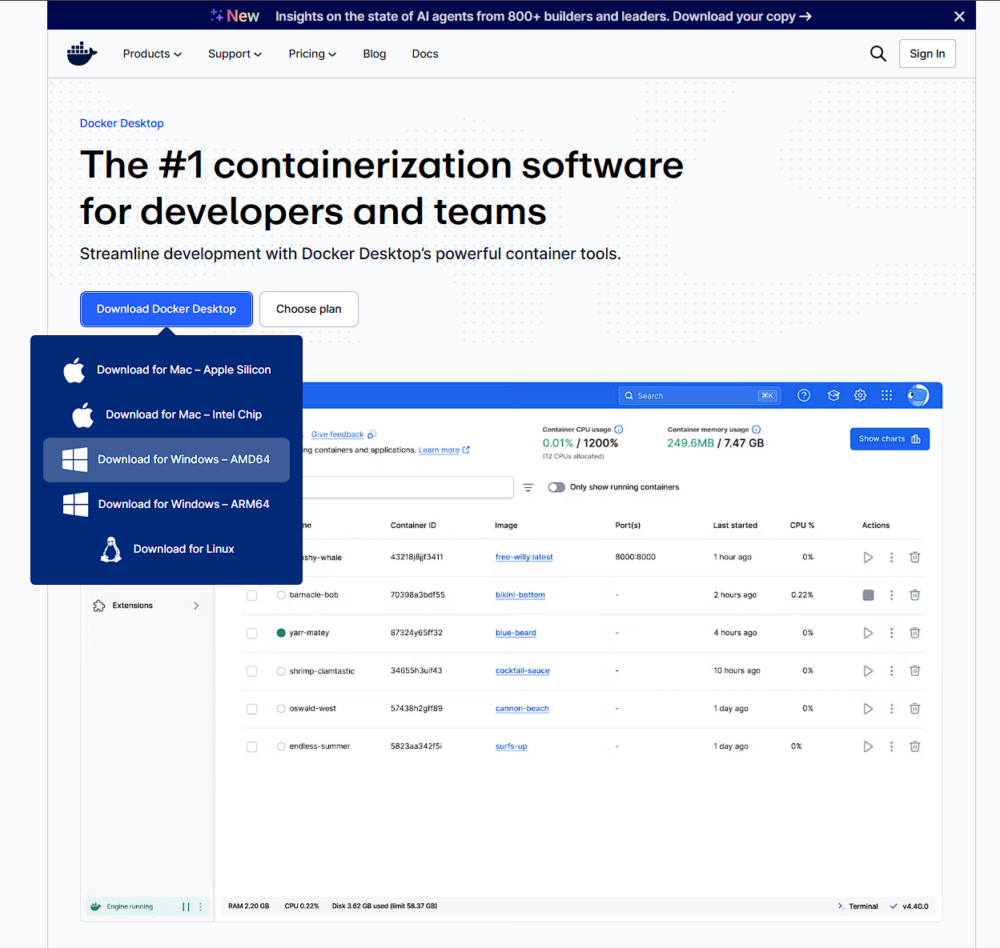

> Windows 사용자는 **Download for Windows – AMD64**

> 🖥️ **"AMD64" 는 AMD CPU 전용이 아닙니다.** Intel · AMD 를 모두 포함하는 이름이라 **대부분의 업무용 노트북은 AMD64** 입니다.
> 확인하려면 `Win` + `Pause` → **시스템 종류** 를 보세요. `x64 기반 프로세서` 면 AMD64, `ARM 기반` 이면 ARM64 입니다.

#### ② 설치 옵션 — 그대로 두고 OK

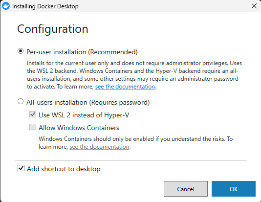

기본값이 이미 올바릅니다 — **아무것도 바꾸지 말고 [OK]**.

| 항목 | 왜 그대로 두나요? |
|---|---|
| **Per-user installation** (선택됨) | 관리자 비밀번호가 필요 없고, 우리가 쓰는 방식(WSL 2)으로 설치됩니다 |
| **Allow Windows Containers** (해제됨) | T³Composer 의 프로그램은 전부 Linux 방식이라 켤 필요가 없습니다 |
| **Add shortcut to desktop** | 취향 — 켜두면 바탕화면에서 바로 찾을 수 있습니다 |

#### ③ 설치 완료 → PC 재시작

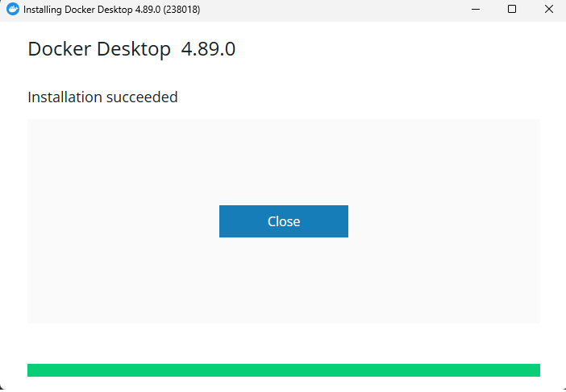

**[Close and restart]** 를 누르면 PC 가 다시 시작됩니다 — 저장하지 않은 작업이 있다면 먼저 저장하세요.

#### ④ 약관 동의

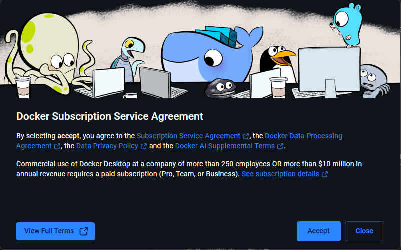

재시작 후 처음 실행하면 나옵니다 — **[Accept]**.

> 💼 **회사에서 쓸 때 확인할 것** — 화면에 적혀 있듯, **직원 250명 초과 또는 연 매출 $1,000만 초과** 기업이 업무용으로 쓰려면 유료 구독이 필요합니다. 사내 정책을 한 번 확인해 주세요.

#### ⑤ 로그인은 건너뛰세요

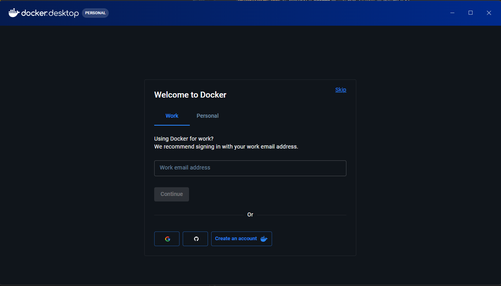

오른쪽 위의 작은 **Skip** 을 클릭 — 계정을 만들 필요가 없습니다.

> 🙅 **계정을 만들지 마세요.** 가운데의 입력창 · `Continue` · Google · GitHub 버튼이 크게 보여서 꼭 해야 할 것 같지만, **T³Composer 를 쓰는 데 Docker 계정은 필요 없습니다.** 위쪽 `Work` / `Personal` 탭도 고를 필요 없습니다.
> Skip 다음에 설문 화면이 한 번 더 나오면 그것도 건너뛰시면 됩니다.

#### ⑥ 준비 완료 확인

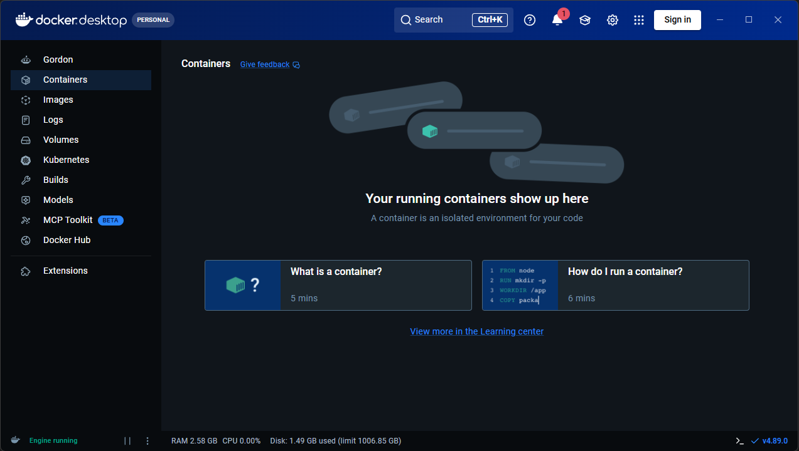

왼쪽 아래에 **Engine running** 초록 글씨가 보이면 준비 끝입니다.

> ✅ **목록이 비어 있어도 정상입니다.** 아직 아무 프로그램도 켜지 않았으니 당연히 비어 있습니다. **Engine running** 초록 글씨 하나만 확인하면 됩니다.

> 🛡️ **설치 중 "Windows 보안" 창이 뜨면 [허용]** — Docker 가 프로그램들끼리 통신하려면 필요합니다. `더 많이 표시` 를 눌러 **개인 네트워크만** 체크하면 더 안전합니다. 이 창은 처음 한 번만 나옵니다.
> 실수로 [취소] 를 눌렀다면 — `Windows 보안 → 방화벽 및 네트워크 보호 → 방화벽을 통해 앱 허용` 에서 `Docker Desktop Backend` 를 찾아 체크하면 됩니다.

### 1-4. 소스 내려받기 — 3가지 방법 중 하나 선택

먼저 프로그램 파일을 내 PC 로 복사해 옵니다. **아래 3가지 중 편한 방법 하나만** 하시면 됩니다.
결과는 모두 같습니다.

#### 🖱️ 방법 A — GitHub Desktop (초보자 추천)

클릭만으로 받을 수 있어 가장 쉽습니다.
[GitHub Desktop](https://desktop.github.com/) 을 설치한 뒤:

1. 상단 메뉴 **File → Clone repository…** 클릭
2. **URL** 탭 선택
3. 주소 칸에 아래를 붙여넣기
   ```
   https://github.com/zionex/t3-composer.git
   ```
4. **Local path** 에 저장할 폴더 지정 (예: `D:\work`)
   → 실제로는 `D:\work\t3-composer` 폴더가 만들어집니다. **이 경로를 기억해 두세요.**
5. **Clone** 버튼 클릭 → 다운로드 완료까지 대기

#### 🌳 방법 B — SourceTree

1. 상단 **[+ New] → Clone from URL** 클릭
2. **Source Path / URL** 에 아래를 붙여넣기
   ```
   https://github.com/zionex/t3-composer.git
   ```
3. **Destination Path** 에 저장할 폴더 지정 (예: `D:\work\t3-composer`)
4. **Clone** 버튼 클릭

#### ⌨️ 방법 C — 명령어 (Git 설치 필요)

명령창을 열고 (여는 방법은 **1-4** 참고) **소스를 저장할 상위 폴더**에서
아래 중 하나를 실행합니다.

```bash
# HTTPS — 가장 무난 (아이디/토큰으로 인증)
git clone https://github.com/zionex/t3-composer.git

# SSH — SSH 키를 미리 등록해 둔 분만
git clone git@github.com:zionex/t3-composer.git

# GitHub CLI — gh 를 설치해 둔 분만
gh repo clone zionex/t3-composer
```

> 💡 **SSH 와 HTTPS 중 뭘 골라야 하나요?**
> 처음이라면 **HTTPS** 를 쓰세요. SSH 는 미리 "SSH 키"라는 것을 GitHub 에 등록해 둔 분만
> 동작합니다. 셋 중 무엇으로 받든 이후 과정은 완전히 동일합니다.

### 1-5. 명령창 열기 — 어디에 명령어를 입력하나요?

다음 단계부터는 검은 명령창에 명령어를 입력합니다.
**가장 중요한 건 "어느 폴더에서" 입력하느냐**입니다 —
반드시 **방금 내려받은 `t3-composer` 폴더 안**이어야 합니다.

**가장 쉬운 방법 — 탐색기에서 바로 열기 (추천)**

1. 파일 탐색기에서 `t3-composer` 폴더로 들어갑니다
   (폴더 안에 `docker-compose.yml` 파일이 보이면 제대로 찾아온 것입니다)
2. 위쪽 **주소 표시줄을 클릭**해서 경로가 파랗게 선택되게 합니다
3. 거기에 **`cmd`** 를 입력하고 **Enter**
   → 그 폴더 위치에서 검은 창이 바로 열립니다. 경로를 따로 입력할 필요가 없어 가장 실수가 적습니다.

**다른 방법들**

| 도구 | 여는 방법 |
|---|---|
| **VS Code** | **File → Open Folder** 로 `t3-composer` 폴더를 연 뒤, **Ctrl + `** (숫자 1 왼쪽의 백틱 키) 를 누르면 아래쪽에 터미널이 열립니다. 이미 폴더 위치가 잡혀 있어 편합니다. |
| **PowerShell** | 시작 메뉴에서 `PowerShell` 검색 후 실행 → `cd D:\work\t3-composer` 처럼 **직접 경로 이동이 필요**합니다. |
| **GitHub Desktop** | 메뉴 **Repository → Open in Command Prompt** 를 누르면 해당 폴더에서 창이 열립니다. |

**위치가 맞는지 확인하는 법**

명령창 왼쪽에 **현재 폴더 경로**가 표시됩니다. 끝이 `t3-composer` 로 끝나야 정상입니다.

```
✅ 올바름   D:\work\t3-composer>
❌ 잘못됨   C:\Users\hong>          ← 내 PC 기본 위치, 아직 이동 안 함
```

잘못된 위치라면 아래처럼 이동하세요 (경로는 본인이 저장한 곳으로).

```bash
cd D:\work\t3-composer
```

### 1-6. 프로그램 실행

`t3-composer` 폴더에서 명령창이 열려 있다면, 아래를 순서대로 붙여넣습니다.
(검은 창이 낯설어도 괜찮습니다 — 복사·붙여넣기만 하면 됩니다)

```bash
# 1) 컨테이너 기동 (백그라운드 실행) — 첫 실행은 5~10분 소요
docker compose up -d

# 2) 상태 확인 — 아래처럼 나오면 정상
docker compose ps
#   composer-backend    Up (healthy)
#   composer-db         Up (healthy)
#   composer-frontend   Up
#   target-mssql        Up (healthy)

# 3) 브라우저 주소창에 입력
#   http://localhost:5173
```

> ⏱️ **첫 기동은 5~10분 정도 걸립니다.** 프로그램을 내려받아 조립하는 과정이라 처음 한 번만
> 오래 걸리고, 이후에는 수십 초면 켜집니다. 창이 멈춘 것처럼 보여도 기다려주세요.

> ⚠️ **포트 충돌 오류가 나면?** `5173 · 8090 · 11433 · 15432` 번호가 이미 다른 프로그램에서
> 쓰이고 있다는 뜻입니다. 대부분 **기존에 켜둔 프로그램을 끄면** 해결됩니다. 계속 충돌하면
> `docker-compose.yml` 파일을 열어 그 번호만 다른 숫자로 (예: `5173` → `5174`) 바꾸고 다시 실행하세요.


#### 화면으로 따라가기

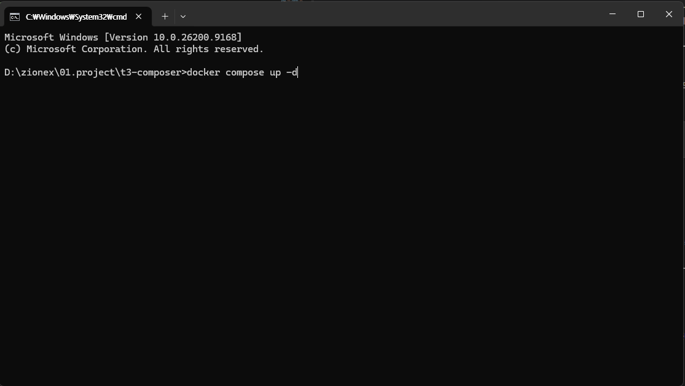

1. **맨 앞의 경로가 `...\t3-composer>` 인지** 꼭 확인하고 입력하세요.

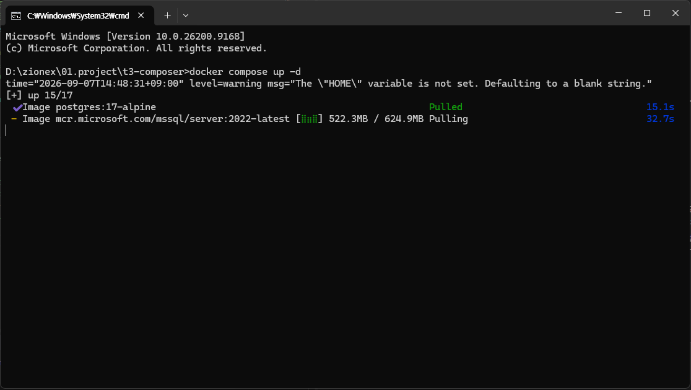

2. 필요한 프로그램을 내려받는 중 — **이 화면이 가장 오래 걸립니다.**

> ⚠️ 노란 글씨 `The "HOME" variable is not set` 가 보여도 **정상입니다.** `HOME` 은 Mac/Linux 에서 쓰는 이름이라 Windows 에는 없습니다. 프로그램은 대신 Windows 용 이름을 알아서 사용합니다.

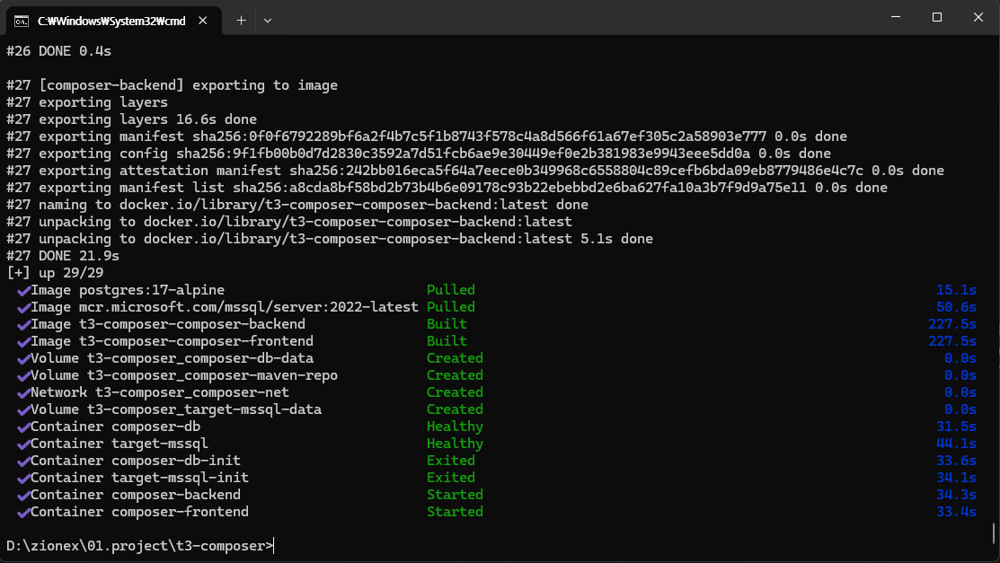

3. 모든 줄에 **✔** 가 붙고 다시 입력 가능한 상태가 되면 명령은 끝난 것입니다.

> 🤔 **`Exited` 라고 나왔는데 실패한 건가요? — 아닙니다.** `composer-db-init` 과 `target-mssql-init` 두 개는 **데이터베이스 초기 준비만 하고 스스로 끝나는 프로그램**입니다. 할 일을 마치고 종료된 것이라 `Exited` 가 **정상**입니다 — 앞에 **✔** 가 붙어 있죠. 나머지 4개가 `Healthy` · `Started` 면 성공입니다.

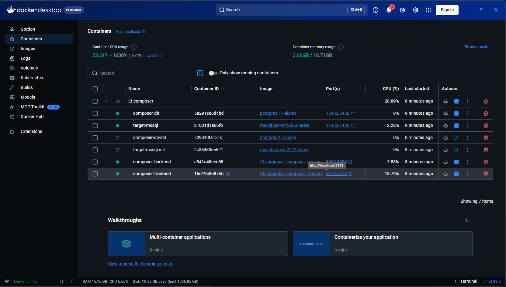

4. Docker Desktop 에서 `t3-composer` 왼쪽 **>** 를 눌러 펼친 모습 — 초록 4개 + **회색 2개(정상)**.

> 🎨 **색으로 보는 상태** — 🟢 **초록** = 실행 중 · ⚪ **회색** = 멈춤. 회색 2개(`-init`)는 **일을 마치고 꺼진 것**이라 그대로 두세요 — ▶ 를 눌러 다시 켤 필요가 없습니다.

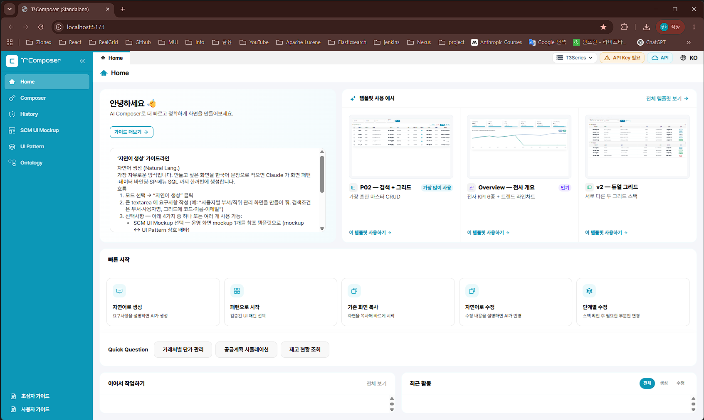

5. `composer-frontend` 줄의 **5173:5173** 을 클릭하면 브라우저가 바로 열립니다 — 주소를 외울 필요가 없습니다.

### 1-7. Docker Desktop 사용법 — 매일 쓰는 4가지

설치가 끝나면 **명령창은 더 이상 필요 없습니다.** 끄고 켜고 확인하는 일은 전부 Docker Desktop 화면에서 클릭으로 합니다.

> 🔁 **PC 를 껐다 켜도 알아서 다시 켜집니다.** `docker compose up -d` 는 **처음 한 번만** 치면 됩니다. 다음부터는 PC 를 켜고 Docker Desktop 이 실행되면 자동으로 다시 올라옵니다.
> **단, 내가 직접 ■ 로 멈춘 경우에는** 다시 ▶ 를 눌러 켜야 합니다.

#### ① 끄기 · 켜기

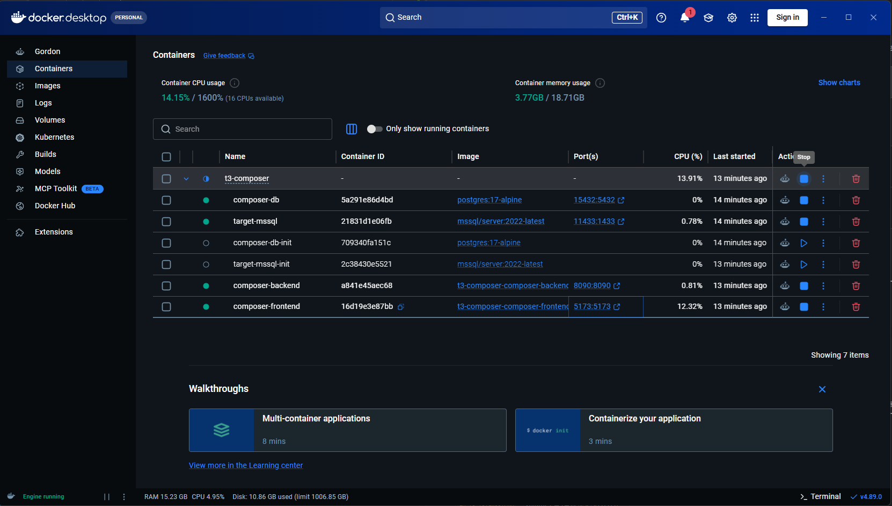

맨 위 `t3-composer` 줄의 **■** 를 누르면 **6개가 한 번에** 꺼집니다 (다시 켤 땐 같은 자리의 **▶**).

#### ② 다시 시작 — 뭔가 이상할 때 첫 번째로

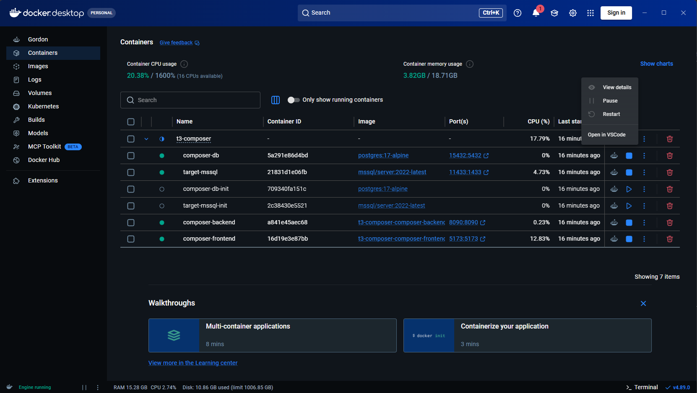

줄 오른쪽 **⋮** 클릭 → **Restart**.

> 🧊 **`Pause` 는 누르지 마세요.** Pause 는 "잠깐 얼려두기" 라서 **화면상으로는 켜져 있는데 실제로는 응답하지 않습니다.** 원인을 찾기 어려워지니, **끌 땐 ■ (Stop), 이상하면 ↺ (Restart)** 두 개만 쓰세요.

#### ③ 기록(로그) 보기 — 오류 원인 찾기

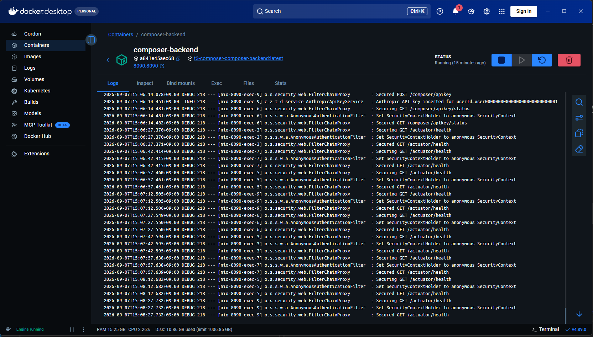

컨테이너 **이름을 클릭** → **Logs** 탭 — 프로그램이 남긴 기록이 보입니다.

> 🔍 **같은 줄이 계속 반복돼도 정상입니다.** `/actuator/health` 는 Docker 가 **15초마다 "잘 살아있니?" 하고 확인하는 신호**입니다. 문제를 찾을 땐 오른쪽 **🔍** 를 눌러 `ERROR` 또는 `Exception` 을 검색하세요.

#### ④ Volumes — 내 작업 내용이 저장되는 곳

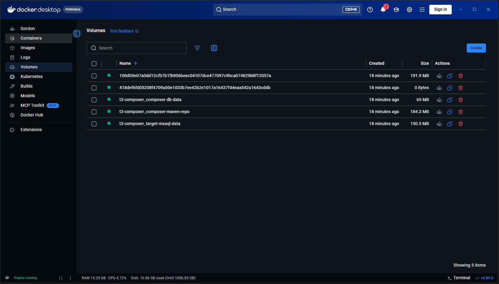

왼쪽 **Volumes** 메뉴 — 🟢 는 **현재 사용 중** 이라는 뜻입니다.

> 🗄️ **여기 있는 것을 지우면 작업 내역이 사라집니다.** 컨테이너가 "프로그램" 이라면 볼륨은 **그 프로그램이 저장해 둔 데이터**입니다. 등록한 API 키 · Target DB 정보 · 지금까지 만든 작업 기록이 모두 여기 들어 있습니다.
> **평소에는 이 화면을 열어볼 일이 없습니다.** 구경만 하고 **지우지 마세요.**

### 1-8. 첫 설정 — 화면 안에서 두 가지 입력

접속에 성공하면 마지막으로 두 가지를 프로그램 화면 안에서 입력합니다.
**둘 다 한 번만 입력하면 계속 저장됩니다.**

> 📍 **어디에 있나요?**
> 두 설정은 **화면 맨 위 오른쪽 끝**, 언어 선택(**🌐 KO**) **바로 왼쪽**에 나란히 있습니다.
> 어느 메뉴에 있든 항상 같은 자리에 보이므로, 필요할 때 언제든 클릭하면 됩니다.

```
┌──────────────────────────────────────────────────────────────┐
│ T³Composer      [🗄 T3Series ⌄] [🔑 API Key] [☁ API]  [🌐 KO] │
├───────────┬──────────────────────────────────────────────────┤
│ 🏠 Home   │  ↑ 맨 위 오른쪽, 언어 선택 [🌐 KO] 왼쪽에 칩 3개    │
│ ✨Composer│    ② Target DB → [🗄 T3Series ⌄] 클릭             │
│ 🕐 History│    ① API 키    → [🔑 API Key] 클릭                │
│ 🗂 Mockup │    [☁ API] 는 AI 연결 방식 표시용 (누를 필요 없음) │
└───────────┴──────────────────────────────────────────────────┘
```

> 🎨 **칩 색으로 상태를 알 수 있습니다.**
> `🔑 API Key` **초록** = 등록 완료 / `⚠ API Key 필요` **주황** = 아직 등록 전

**① Anthropic API 키 등록**

맨 위 오른쪽 **API Key 칩**(언어 선택 왼쪽)을 클릭하면 입력창이 열립니다.

- **주황색**(`⚠ API Key 필요`) 이면 아직 등록 전 → 클릭해서 키를 붙여넣고 [저장]
- 저장하면 자동으로 검증한 뒤 **초록색**(`🔑 API Key`) 으로 바뀝니다
- "설명" 칸은 비워도 되고, `Personal key` 처럼 메모용으로 적어도 됩니다

| 등록 전 | 등록 후 |
|---|---|
| 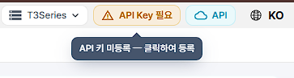 | 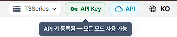 |

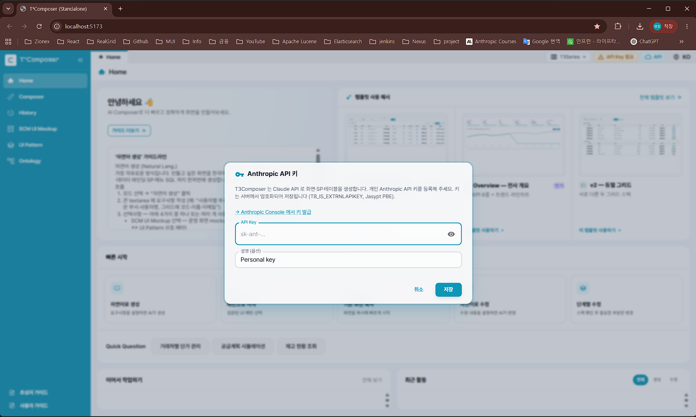

주황색 칩을 클릭하면 열리는 입력창 — 키를 붙여넣고 **[저장]**.

> 📋 **키 원본은 따로 보관하세요.** 저장한 키는 **화면에 다시 표시되지 않습니다.** 나중에 확인하거나 다른 PC 에 다시 입력해야 할 수 있으니, 받은 키는 안전한 곳에 보관해 두세요.
> 입력창 오른쪽 **👁** 는 방금 붙여넣은 키를 확인할 때만 쓰고, 다른 사람이 보는 화면에서는 누르지 마세요.

> 🔑 **API 키는 비밀번호와 같습니다.** 메신저·이메일로 주고받거나 화면 캡처에 찍히지 않도록
> 주의하세요.

**② Target DB 연결**

어느 프로젝트의 데이터를 쓸지 연결하는 설정입니다 (Target 개념은 2장에서 설명).
**여기는 두 번 클릭**해야 창이 열립니다.

1. 맨 위 오른쪽 **[🗄 T3Series ⌄]** 칩을 클릭 → **Target 목록이 아래로 펼쳐집니다**
2. 목록에서 사용할 Target 줄의 오른쪽 **🗄️ 아이콘**을 클릭
   → 아이콘이 **파란색**이면 이미 설정된 상태, **회색**이면 아직 미설정입니다.
   (옆의 📷 아이콘은 다른 기능이니 누르지 마세요)

그러면 아래 창이 열립니다.

```
┌──────────────────────────────────────────────────────────┐
│ 🗄️ Target DB 접속 정보 — T3Series            [MSSQL]      │
├──────────────────────────────────────────────────────────┤
│ ┌──────────────────────────────────────────────────────┐ │
│ │ JDBC URL                                             │ │
│ │ jdbc:sqlserver://<host>:21433;databaseName=T3SMARTSCM;│ │
│ │ encrypt=true;trustServerCertificate=true              │ │
│ └──────────────────────────────────────────────────────┘ │
│ ┌───────────────────────┬──────────────────────────────┐ │
│ │ Username              │ Password                     │ │
│ │ education1            │ ••••••••••••••               │ │
│ └───────────────────────┴──────────────────────────────┘ │
│ ┌──────────────────────────────────────────────────────┐ │
│ │ Driver Class (선택)                                   │ │
│ │ com.microsoft.sqlserver.jdbc.SQLServerDriver          │ │
│ └──────────────────────────────────────────────────────┘ │
│                                                          │
│ 📁 Target source path                                    │
│ ┌──────────────────────────────────────────────────────┐ │
│ │ source 폴더 경로                                       │ │
│ │ /workspace/projects/t3series-1xma/t3series-wingui     │ │
│ └──────────────────────────────────────────────────────┘ │
│ ┌──────────────────────────────────────────────────────┐ │
│ │ backend 폴더 경로 (분리 구조일 때만)                     │ │
│ │ (비워두면 source 와 동일)                               │ │
│ └──────────────────────────────────────────────────────┘ │
│                        [닫기] [▶ 연결 테스트] [💾 저장]    │
└──────────────────────────────────────────────────────────┘
```

**각 칸에 무엇을 넣나요?**

| 항목 | 설명 |
|---|---|
| **JDBC URL** | 접속할 DB 주소입니다. `<host>` 자리에 **서버 주소**, `databaseName=` 뒤에 **DB 이름**을 넣습니다. 뒤쪽 `encrypt=true;trustServerCertificate=true` 는 **지우지 마세요** — 빠지면 연결이 거부됩니다.<br>※ 주소 안의 숫자(`21433` 등)는 **프로젝트마다 다른 포트 번호** — 1-5 의 설치용 번호와 달라도 정상입니다. |
| **Username / Password** | DB 계정과 비밀번호입니다. |
| **Driver Class** | **선택 항목** — 기본값이 이미 채워져 있으니 그대로 두시면 됩니다. |
| **source 폴더 경로** | 기존 화면을 복사·수정할 때 참고할 **원본 소스 위치**입니다. 신규 화면만 만들 거라면 비워도 됩니다. |
| **backend 폴더 경로** | **선택 항목** — 프론트와 백엔드가 따로 있는 프로젝트만 입력. 비우면 위 source 경로와 같은 것으로 처리됩니다. |

- 입력값(서버 주소·계정·비밀번호)은 **담당하시는 프로젝트의 DB 접속 정보**입니다 —
  평소 그 프로젝트에서 사용하는 접속 정보를 그대로 입력하면 됩니다
- 입력 후 **[▶ 연결 테스트]** 를 눌러 초록색 성공 메시지를 확인한 뒤 **[💾 저장]** 을 누르세요
- 비워두면 연습용 샘플 데이터로 동작합니다 (실제 업무 데이터는 안 보임)

> ⚠️ **연결 테스트가 실패하면?** 대부분 서버 주소·계정 오타이거나, JDBC URL 뒤쪽
> `encrypt=true;trustServerCertificate=true` 가 빠진 경우입니다. 두 가지를 다시 확인한 뒤
> 재시도해 보세요.

> ✅ **여기까지 왔으면 설치 완료입니다.** 2장으로 넘어가서 T³Composer 가 무엇인지 살펴본 뒤,
> 3장에서 첫 화면을 만들어 보세요.

---

## 2. T³Composer가 뭔가요?

### 한 줄로 말하면

**말로 설명하면 화면을 대신 만들어주는 프로그램**입니다.

지금까지는 "이런 화면이 필요합니다" 라고 문서를 써서 개발팀에 전달하고,
개발자가 그 문서를 보고 코드를 작성했습니다. 이 과정은 보통 며칠씩 걸렸습니다.

T³Composer 는 그 중간 과정을 줄여줍니다. **문서 대신 채팅창에 요구사항을 입력**하면,
AI(인공지능)가 문서화·화면 설계·코드 작성까지 대신 진행합니다.

### 비유로 이해하기

| 비유 | 설명 |
|---|---|
| **화면** | 엑셀 시트 한 장이라고 생각하세요. 조회 조건(검색창)이 있고, 아래 표(그리드)가 있는 형태가 대부분입니다. |
| **테이블** | 화면에 표시되는 데이터가 저장된 엑셀 파일이라고 생각하세요. "사용자 목록"을 보여주려면 "사용자 정보가 저장된 테이블"을 연결해야 합니다. |
| **Target(타겟)** | "어느 회사(프로젝트)의 화면을 만들 것인가" 를 고르는 라벨입니다. 회사마다 사용하는 데이터베이스·화면 부품이 달라서, 시작 전에 먼저 골라야 합니다. |
| **메뉴 등록** | 만든 화면을 실제 프로그램의 메뉴 목록에 추가하는 것 — 새 엑셀 파일을 즐겨찾기에 등록하는 것과 비슷합니다. |
| **산출물(코드)** | AI가 만들어낸 화면 파일들의 모음. 눈으로 보는 화면 1개를 만들려면 실제로는 여러 개의 파일이 함께 필요합니다 (뒤에서 설명). |

### 할 수 있는 것 / 아직 못 하는 것

| ✅ 할 수 있는 것 | ⚠️ 아직 어려운 것 |
|---|---|
| 검색 조건 + 표(그리드) 형태의 조회 화면 | 3D 그래픽, 복잡한 애니메이션 |
| 등록·수정·삭제(CRUD)가 되는 관리 화면 | 매우 독특한 디자인의 화면 |
| 기존 화면과 비슷한 새 화면 (복사 후 일부만 변경) | 새로운 업무 로직을 처음부터 설계하는 것 (업무 담당자 확인 필요) |
| KPI 카드·차트가 있는 대시보드 | 여러 화면이 서로 연동되는 복잡한 흐름 |

---

## 3. 5분 안에 첫 화면 만들어보기

지금 바로 따라 해볼 수 있는 가장 쉬운 시나리오입니다. 실제로 데이터가 저장되지는 않으니
편하게 눌러보세요 (아래 "미리보기" 개념 참고).

### 3-1. 처음 화면 (Home)

프로그램을 열면 아래와 같은 화면이 나옵니다.

> 🔐 **혹시 "인증키"를 입력하라는 로그인 화면이 먼저 뜨나요?**
> 일부 환경에서만 켜두는 **선택 기능**입니다. 인증키를 입력하면 아래 화면으로 넘어갑니다.
> **키는 규칙만 알면 직접 만들 수 있습니다** — 만드는 법은 **13-3** 를 보세요.

```
┌──────────────────────────────────────────────────────────────┐
│  🏠 T³Composer                                    [한국어 ▾]  │
├───────────┬──────────────────────────────────────────────────┤
│           │                                                  │
│ 🏠 Home   │   👋 무엇을 만들어 드릴까요?                        │
│ ✨ Composer│                                                  │
│ 🕐 History │   ┌─────────┬─────────┬─────────┬────────┬──────┐ │
│ 🗂 Mockup  │   │자연어로  │패턴으로  │화면 복사 │자연어  │패턴  │ │
│ 📚 Pattern │   │만들기    │시작하기  │해서 시작 │수정    │수정  │ │
│ 🕸 Ontology│   └─────────┴─────────┴─────────┴────────┴──────┘ │
│           │                                                  │
│           │   최근 작업 이력 ...                               │
└───────────┴──────────────────────────────────────────────────┘
```

- 왼쪽 세로 줄이 **메뉴** 입니다 (4장에서 자세히 설명).
- 가운데 5개 카드가 **빠른 시작** 버튼입니다. 오늘은 첫 번째 카드 **"자연어로 만들기"** 를 눌러보겠습니다.

### 3-2. "자연어로 만들기" 클릭 → 모듈 선택

"자연어" 란 우리가 평소 쓰는 말 그대로를 뜻합니다 (프로그래밍 언어가 아니라는 뜻).
버튼을 누르면 먼저 **모듈을 고르는 화면**이 나옵니다.

> 🧩 **모듈이 뭔가요?** — 업무 영역을 나눈 **서랍**이라고 생각하세요.
> "수요 계획 화면"은 `DP` 서랍, "품목 마스터 화면"은 `CM` 서랍에 들어갑니다.
> 고르기만 하면 **그 업무에 맞는 규칙과 자주 쓰는 데이터를 AI가 알아서 참고**합니다.

```
┌──────────────────────────────────────────────────────────────┐
│  ←   자연어 기반 신규 생성                                     │
├──────────────────────────────────────────────────────────────┤
│  모듈 선택                                                     │
│  생성할 화면이 속한 모듈을 선택하세요.                          │
│                                                                │
│  ┌────────┬────────┬────────┬────────┐                        │
│  │ DP     │ MP     │ FP     │ RP     │                        │
│  │수요계획 │마스터계획│공장계획 │보충계획 │                        │
│  ├────────┼────────┼────────┼────────┤                        │
│  │ BF     │ IM     │ SA     │ SO     │                        │
│  │예측     │재고관리 │S&OP    │판매주문 │                        │
│  ├────────┼────────┼────────┼────────┘                        │
│  │[ CM ]  │ AD     │ UT     │  ← CM 선택됨                     │
│  │공통마스터│시스템관리│유틸리티 │                                │
│  └────────┴────────┴────────┘                                 │
└──────────────────────────────────────────────────────────────┘
```

| 모듈 | 이런 화면일 때 | 예시 |
|---|---|---|
| **CM** 공통 마스터 | 품목·창고·거래처 등 **기준정보** | 품목 마스터 관리 |
| **DP** 수요 계획 | 수요 예측·계획 입력 | 월별 수요 계획 입력 |
| **MP** 마스터 계획 | 생산·자원 계획 | 자원 가동 현황 |
| **IM** 재고 관리 | 재고 정책·안전재고 | 안전재고 정책 관리 |
| **AD** 시스템·관리 | 사용자·권한·메뉴 등 **관리 화면** | 사용자 관리 |
| **UT** 유틸리티 | 공지·이슈·대시보드 등 **부가 기능** | 공지사항 관리 |

> 💡 **확신이 안 서면?** 일단 가장 가까워 보이는 것을 고르세요. 다음 화면에서
> **[모듈 변경]** 으로 언제든 바꿀 수 있습니다. 연습이라면 `CM`(공통 마스터) 또는
> `UT`(유틸리티)가 무난합니다.

### 3-3. 요구사항 입력 화면 살펴보기

모듈을 고르면 아래 화면이 나옵니다. **★ 표시된 두 곳만** 신경 쓰면 되고,
나머지는 비워둬도 됩니다.

```
┌──────────────────────────────────────────────────────────────┐
│  ←  자연어 기반 신규 생성 / CM · 공통 마스터                    │
├──────────────────────────────────────────────────────────────┤
│  요구사항 입력                                    [모듈 변경]  │
│  ┌────────────────────────────────────────────────────────┐  │
│  │ ★ 예: 품목 마스터 관리 — 검색 + 단일 그리드              │  │
│  │   (여기에 만들고 싶은 화면을 말로 적습니다)                │  │
│  └────────────────────────────────────────────────────────┘  │
│                                                                │
│  AI 엔진:  [⚡ Sonnet — 빠름]  [💎 Opus — 기본값 ✓]            │
│                                                                │
│  선택사항: [SCM UI Mockup 선택] [UI Pattern 선택]  (둘 중 하나)│
│  ⬆ 참조 파일 첨부 — SQL · 설계서 이미지 등 (최대 5개)           │
│  [Data Source 선택]                                            │
│                                                                │
│                          ★ [ ✨ Claude 에게 생성 요청 ]        │
└──────────────────────────────────────────────────────────────┘
```

| 영역 | 꼭 해야 하나요? |
|---|---|
| **요구사항 입력창** | **✅ 필수** — 만들고 싶은 화면을 말로 적는 곳 (3-4 참고) |
| **AI 엔진** | 기본값 **Opus** 그대로 두면 됩니다. Opus = 고품질(조금 느림) · Sonnet = 빠름. 복잡한 화면일수록 Opus 가 유리합니다. |
| SCM UI Mockup / UI Pattern | 선택 — "이런 느낌으로" 참고 화면을 지정할 때만 (둘 중 하나만) |
| 참조 파일 첨부 | 선택 — 설계서 이미지·SQL 파일이 있을 때만 |
| Data Source 선택 | 선택 — 쓸 테이블을 직접 지정하고 싶을 때만 (안 골라도 AI가 찾습니다) |
| **[Claude 에게 생성 요청]** | **✅ 마지막에 클릭** — 여기서 생성이 시작됩니다 |

### 3-4. 요구사항 입력해보기

아래처럼 **평소 회의에서 말하듯이** 적으면 됩니다. 표 이름·컬럼 이름 같은 걸 몰라도 괜찮습니다
(모르면 AI가 물어보거나, 비슷한 이름으로 추측한 뒤 화면에 표시해줍니다).

> **예시 입력**
> "사용자 목록을 보여주는 화면을 만들어줘. 이름과 부서로 검색할 수 있고,
> 목록에서 사용자를 추가·수정·삭제할 수 있으면 좋겠어."

**[✨ Claude 에게 생성 요청]** 버튼을 누르면 AI가 화면을 만들기 시작합니다.
화면 오른쪽에 진행 상황이 표시되고, 보통 수십 초~몇 분 정도 걸립니다.

### 3-5. 작업 화면 둘러보기 — 채팅창은 여기 있습니다

생성 요청을 누르면 **작업 화면**으로 넘어갑니다. 처음에는 복잡해 보이지만 **크게 세 부분**뿐입니다.

```
┌──────────────────────────────────────────────────────────────┐
│ 사용자 관리 화면  [▶화면실행] [①메뉴등록] [②산출물실행] [처음부터다시]│
├───────────────┬──────────────────────────────────────────────┤
│ 📁 산출물 (7)  │  [실행 화면] [산출물 소스]   ← 오른쪽 탭        │
│  UserMgmt.jsx │ ─────────────────────────────────────────────│
│  UserMgmt.java│                                              │
│  …            │   [화면 실행] 을 누르면                        │
├───────────────┤   여기에 만들어진 화면이 나타납니다              │
│ 💬 작업 내역   │                                              │
│   (채팅창) ★   │                                              │
│  나: 사용자... │                                              │
│  AI: 완료했... │                                              │
│ ┌───────────┐ │                                              │
│ │수정 요청… │ │  ← 여기가 "채팅창" 입니다                      │
│ └───────────┘ │                                              │
└───────────────┴──────────────────────────────────────────────┘
```

| 위치 | 무엇을 하는 곳인가요? |
|---|---|
| **📁 왼쪽 위 — 산출물** | AI가 만든 **파일 목록**입니다. 화면 1개에 파일 여러 개가 만들어집니다. **눌러보지 않아도 됩니다** — 개발자가 나중에 확인하는 영역입니다. |
| **💬 왼쪽 아래 — 작업 내역 (채팅창)** | **★ 가장 많이 쓰는 곳입니다.** 지금까지 주고받은 대화가 쌓이고, 맨 아래 입력칸에 **수정 요청을 계속 이어서** 적을 수 있습니다. 이 가이드에서 **"채팅창에 입력하세요"** 라고 하는 곳이 바로 여기입니다. |
| **🖥 오른쪽 — 실행 화면 / 산출물 소스** | **실행 화면** 탭에 만들어진 화면이 표시됩니다 (초심자는 이 탭만 보면 됩니다). **산출물 소스** 탭은 코드를 보는 곳이라 **안 봐도 괜찮습니다**. |
| **위쪽 버튼들** | **[▶ 화면 실행]** 미리보기 · **[① 메뉴 등록] [② 산출물 실행]** 실제 반영 (6장) · **[처음부터 다시]** 새로 시작 (이전 작업은 History 에 남습니다) |

> 💬 **채팅창 사용 팁**
> · **Ctrl + Enter** 로 전송됩니다 (Enter 만 누르면 줄바꿈)
> · 이전 대화 내용이 그대로 이어지므로 **"아까 그 화면에서 ~~ 바꿔줘"** 처럼 말해도 통합니다
> · 한 번에 하나씩 요청하면 결과가 더 안정적입니다 (10장 참고)

> 🕐 **중간에 닫아도 괜찮습니다.** 작업은 자동으로 저장되어, 왼쪽 메뉴 **History** 에서
> **해당 줄을 클릭**하면 이 작업 화면이 그대로 다시 열립니다.

### 3-6. 결과 확인하기 (미리보기)

작업이 끝나면 화면 상단에 다음과 같은 버튼들이 나타납니다.

```
[ ▶ 화면 실행 ]   ☐ 오류 시 자동보완    ┌─ Target System 적용 ──────┐
                                       │ [① 메뉴 등록] [② 산출물 실행]│
                                       └────────────────────────────┘
```

- **[화면 실행]** 을 눌러보세요. 오른쪽에 방금 설명한 화면이 실제로 어떻게 생겼는지 나타납니다.
  - 이 단계는 **미리보기**입니다. 실제 데이터베이스에 아무 것도 저장되지 않으니 안심하고 눌러보세요.
  - 화면에 가짜(샘플) 데이터가 채워져서, 진짜처럼 움직이는 걸 확인할 수 있습니다.
- 마음에 안 들면 채팅창에 "검색 조건에 입사일도 추가해줘" 처럼 **계속 대화하듯이 수정 요청**을 하면 됩니다.
- 여기서 멈춰도 됩니다. 진짜로 회사 시스템에 반영하려면 6장의 "메뉴 등록 → 산출물 실행"
  단계가 더 필요합니다.

🎉 여기까지가 5분 완주 코스입니다. 축하합니다 — 첫 화면을 만들어 보셨습니다!

---

## 4. 왼쪽 메뉴 둘러보기

화면 왼쪽에 세로로 있는 메뉴들입니다. 각각 어떤 역할인지 간단히 소개합니다.

```
┌───────────┐
│ 🏠 Home    │ ← 시작 화면. 빠른 시작 카드 + 최근 작업 목록
│ ✨ Composer│ ← 화면을 새로 만들거나 수정하는 메인 기능 (5장에서 자세히)
│ 🕐 History │ ← 지금까지 진행한 작업 목록 (이어서 하기 가능)
│ 🗂 Mockup  │ ← "이런 느낌의 화면 있어요" 예시 모음 (참고용 갤러리)
│ 📚 Pattern │ ← 실제 운영 중인 화면 디자인 모음 (참고용 갤러리)
│ 🕸 Ontology│ ← (다소 전문적) 업무 용어·질문-답변 사전 관리
└───────────┘
```

| 메뉴 | 이런 분들이 씁니다 |
|---|---|
| **Home** | 첫 진입 시 열리는 시작 화면. 매번 여기서 출발하면 됩니다. |
| **Composer** | **메인 기능** — 실제로 화면을 새로 만들거나 기존 화면을 고칠 때. |
| **History** | "어제 만들던 화면 이어서 하고 싶은데?" 할 때 — 이전 작업을 다시 열어 이어서 진행. |
| **SCM UI Mockup** | **181개** 운영 화면 예시 갤러리. "이런 느낌으로 만들어줘" 하고 참고 화면을 보여주고 싶을 때. |
| **UI Pattern** | T3MES 퍼블리싱 **730개** 화면 패턴 카탈로그. 실제 운영 중인 비슷한 화면을 참고하고 싶을 때. |
| **Ontology** | Q&A · Entity · View · Process 4영역 업무 용어 사전. (처음에는 몰라도 됩니다 — 익숙해진 뒤 살펴보세요) |

> 💡 **참고 사항 두 가지**
> · **Dashboard** 메뉴가 안 보여도 정상입니다 — 별도 설정을 켠 환경에서만 나타납니다.
> · 사이드바가 좁게 느껴지면 **접기 버튼**으로 아이콘만 남길 수 있습니다
>   (아이콘에 마우스를 올리면 이름이 표시됩니다).

---

## 5. Composer 메뉴 자세히 알아보기

`Composer` 메뉴를 누르면 두 가지 큰 갈래로 나뉩니다.

```
┌──────────────────────────────────────────────────────────────┐
│                     무엇을 하시겠어요?                          │
│                                                                │
│  ┌─── 신규 개발 ───────────┐   ┌─── 기존 화면 수정 ───────┐    │
│  │                          │   │                          │    │
│  │  💬 자연어 생성           │   │  💬 자연어 수정           │    │
│  │  🧩 단계별 생성 (Beta)    │   │  ☑ 단계별 수정           │    │
│  │  📋 기존 화면 복사        │   │                          │    │
│  │                          │   │                          │    │
│  └──────────────────────────┘   └──────────────────────────┘    │
└──────────────────────────────────────────────────────────────┘
```

### 5-1. 신규 개발 — 새 화면을 만들 때

| 방식 | 언제 쓰나요? | 쉬운 설명 |
|---|---|---|
| **💬 자연어 생성** | 가장 쉽고 빠른 방법. 처음이라면 이것부터 | 3장에서 해본 것처럼 채팅으로 요구사항을 설명하면 AI가 알아서 화면 구조·데이터를 정합니다. |
| **🧩 단계별 생성 (Beta)** | 화면 배치(레이아웃)를 내가 직접 정하고 싶을 때 | 화면을 어떻게 나눌지(위/아래, 좌/우) 마우스로 직접 배치한 뒤, 각 영역에 필요한 데이터를 입력합니다. 자연어 생성보다 손이 조금 더 가지만, 원하는 모양을 더 정확하게 만들 수 있습니다. |
| **📋 기존 화면 복사** | "저 화면이랑 거의 똑같은데 몇 개만 다른 화면" 이 필요할 때 | 이미 있는 화면을 하나 고르면 그 구조를 그대로 복사해오고, 달라지는 부분만 대화로 알려주면 됩니다. |

**Beta 란?** "아직 시험 중인 기능" 이라는 뜻입니다. 동작은 하지만 정식 기능보다는 예상치
못한 부분이 있을 수 있다는 의미로 이해하시면 됩니다.

### 5-2. 기존 화면 수정 — 이미 있는 화면을 고칠 때

| 방식 | 언제 쓰나요? | 쉬운 설명 |
|---|---|---|
| **💬 자연어 수정** | 빠르게 몇 군데만 손보고 싶을 때 | 고치고 싶은 화면을 목록에서 고른 뒤, "검색 조건에 상태값도 추가해줘" 처럼 말로 요청합니다. |
| **☑ 단계별 수정** | 여러 곳을 체계적으로 바꾸고 싶을 때 | 화면을 구성요소별로 쪼개서 보여주고, 바꾸고 싶은 부분만 체크해서 수정합니다. |

### 5-3. 화면 만들 때 물어보는 것들 (선택사항)

자연어 생성 화면에는 아래와 같은 "선택사항" 들이 있습니다. **몰라도 그냥 넘어가도 됩니다** —
없어도 AI가 알아서 만들어줍니다. 다만 있으면 더 정확한 결과가 나옵니다.

| 선택사항 | 언제 쓰면 좋은가요? |
|---|---|
| **SCM UI Mockup 선택** | "4장의 Mockup 갤러리에서 본 그 느낌으로 만들어줘" 라고 콕 집어 알려주고 싶을 때 |
| **UI Pattern 선택** | 실제 운영 화면 중 하나를 콕 집어 "이거랑 비슷하게" 라고 알려주고 싶을 때 |
| **참조 파일 첨부** | 화면 설계서 이미지, 참고할 SQL 파일 등을 파일로 가지고 있을 때 (끌어다 놓기 가능, 최대 5개) |
| **Data Source 선택** | (다소 전문적) 사용할 데이터베이스 테이블을 직접 화면에서 찾아 지정하고 싶을 때 |

---

## 6. 화면을 만든 뒤 할 일 — 확인하고 등록하기

AI가 화면을 만들어주면, 그것으로 끝이 아닙니다. 실제 회사 시스템에 반영되려면 순서대로
아래 3단계를 거칩니다.

```
① 화면 실행 (미리보기)  →  ② 메뉴 등록  →  ③ 산출물 실행
   "일단 어떻게           "실제 메뉴          "실제 파일과 데이터베이스에
    생겼나 볼까?"          목록에 추가"        진짜로 반영"
   (안전 · 되돌릴 필요 X)  (되돌리기 어려움)   (되돌리기 어려움 — 신중하게)
```

### ① 화면 실행 (미리보기) — 안심하고 눌러도 됩니다

- 3장에서 해본 그 버튼입니다.
- 화면이 실제로 어떻게 보이는지, 버튼을 눌렀을 때 어떻게 동작하는지 **가짜 데이터로** 확인합니다.
- 몇 번을 눌러도, 잘못 눌러도 문제가 생기지 않습니다.

### ② 메뉴 등록 — 여기부터는 신중하게

- 만든 화면을 프로그램의 진짜 메뉴 목록에 추가하는 단계입니다.
- 등록하면 실제 메뉴에 나타나므로, **①에서 미리보기로 결과를 충분히 확인한 뒤** 누르세요.

> ✅ **누르기 전 체크리스트**
> · 미리보기 화면이 원하는 모양대로 나왔는가?
> · 검색 조건·목록 컬럼이 빠짐없이 들어갔는가?
> · 메뉴 이름(화면 제목)이 알맞게 정해졌는가?
> → 셋 다 OK 면 눌러도 됩니다. 아니면 채팅으로 먼저 수정하세요.

### ③ 산출물 실행 — 실제 반영

- 화면을 이루는 실제 파일들과 데이터베이스 설정을 진짜로 적용하는 단계입니다.
- 메뉴 등록 다음 순서로 진행하는 것이 안전합니다 (버튼 옆 안내 문구에도 그렇게 쓰여 있습니다).

> 🧭 **한 문장 요약**: "①은 마음껏 눌러보고, ②③은 미리보기로 확인한 뒤 누른다."

---

## 7. Target 바꾸기 — 다른 프로젝트 화면 만들기

지금까지 만든 화면은 **하나의 프로젝트(Target)** 를 기준으로 만들어졌습니다. 다른 프로젝트의 화면을 만들어야 한다면 여기를 바꾸면 됩니다.


회사에서 여러 프로젝트를 담당한다면, **Target 을 바꿔가며** 각각의 화면을 만들 수 있습니다.
화면 오른쪽 위 **[🗄 T3Series ⌄]** 칩을 클릭하면 프로젝트 목록이 펼쳐집니다.

> 🔄 **Target 을 바꾸면 이런 것들이 함께 바뀝니다**
> · **보이는 메뉴 목록** — 그 프로젝트의 실제 메뉴를 가져옵니다
> · **사용하는 데이터** — 그 프로젝트의 테이블·데이터를 봅니다
> · **만들어지는 화면 스타일** — 프로젝트마다 쓰는 화면 부품이 달라서 결과물 모양도 달라집니다

| 궁금한 점 | 답 |
|---|---|
| 바꾸면 지금 작업이 사라지나요? | 아니요. 지금까지 작업은 **History 에 그대로** 남습니다. |
| 다음에 열면 초기화되나요? | 아니요. **마지막에 고른 Target 이 그대로 기억**됩니다. |
| 프로젝트마다 DB 를 따로 넣어야 하나요? | 네. Target 별로 한 번씩 입력하면 각각 따로 저장됩니다 (1-8 참고). |

> ⚠️ **화면 만들기 전에 Target 부터 확인하세요.** 엉뚱한 프로젝트로 만들어지면 처음부터
> 다시 해야 합니다. 습관처럼 화면 오른쪽 위 칩을 한 번 보고 시작하세요.

---

## 8. API 키 바꾸기 / 다시 등록하기

**1-8** 에서 처음 등록한 API 키를 나중에 바꾸는 방법입니다. 새 PC 에서 다시 시작할 때도 같은 자리에서 입력하면 됩니다.


키가 만료됐거나 다른 키로 바꾸고 싶을 때는 **같은 자리에서 다시 등록**하면 됩니다.

1. 화면 오른쪽 위 **[🔑 API Key]** 칩을 클릭
2. 새 키를 붙여넣고 **[저장]** — 이전 키는 자동으로 교체됩니다

> 💡 **이럴 때 키를 다시 확인해 보세요**
> · 칩이 갑자기 **주황색**으로 바뀌었을 때
> · 생성 요청을 눌렀는데 "인증" 관련 오류가 날 때
> · 회사 키가 갱신됐다고 안내받았을 때

---

## 9. 오류가 나면 어떻게 하나요?

### "빨간 글씨"나 오류 메시지가 뜨면?

당황하지 않아도 됩니다. 화면 실행 버튼 근처에 있는 **"오류 시 자동보완"** 체크박스를 켜두면,
AI가 스스로 오류 원인을 찾아 화면을 고친 뒤 다시 실행해 봅니다 (최대 몇 차례까지 자동 시도).

```
[ ▶ 화면 실행 ]   ☑ 오류 시 자동보완   ← 이 체크박스를 켜두세요
```

- 자동으로 고쳐지면 별다른 조치가 필요 없습니다.
- 몇 번을 시도해도 안 고쳐지면, "여기서부터는 사람이 봐야 합니다" 라는 안내가 나오면서 멈춥니다.
  이때는 채팅창에 **"다른 방법으로 다시 만들어줘"** 라고 요청하거나, 요구사항을 더 단순하게
  나눠서 다시 시도해 보세요 (10장 참고).

### 그래도 막막할 때

- 채팅창에 "왜 이 오류가 났는지 쉽게 설명해줘" 라고 물어보세요. AI가 원인을 풀어서 설명해줍니다.
- History 메뉴에서 이전 대화 내용을 다시 열어볼 수 있으니, 언제든 이어서 진행할 수 있습니다.

---

## 10. 막혔을 때 스스로 푸는 법

대부분의 막힘은 **AI에게 다시 물어보는 것**으로 풀립니다.
아래는 상황별로 그대로 복사해 쓸 수 있는 문장들입니다.

| 이런 상황이면 | 채팅창에 이렇게 입력하세요 |
|---|---|
| 결과가 내가 원한 모양이 아님 | `"검색 조건에 등록일 기간을 추가하고, 목록에 담당자 컬럼도 넣어줘"` — 바꾸고 싶은 부분을 구체적으로 적을수록 정확해집니다. |
| 오류 메시지가 뜨는데 뜻을 모르겠음 | `"방금 오류가 났어. 무슨 뜻인지 쉽게 설명하고 고쳐줘"` — 오류 내용을 붙여넣으면 더 정확합니다. |
| 어떤 테이블을 써야 할지 모르겠음 | `"사용자 정보가 들어있는 테이블이 뭔지 찾아서 그걸로 만들어줘"` — AI가 연결된 DB에서 직접 찾아봅니다. |
| 계산식·업무 규칙을 어떻게 넣을지 모르겠음 | `"재고회전율 = 출고수량 ÷ 평균재고 로 계산하는 컬럼을 추가해줘"` — **규칙만 말로 알려주면** 코드는 AI가 만듭니다. |
| 같은 오류가 반복되고 자동보완도 안 됨 | `"계속 같은 오류가 나. 다른 방법으로 접근해서 다시 만들어줘"` — 그래도 안 되면 요구사항을 더 단순하게 나눠 요청해보세요. |
| 처음부터 다시 하고 싶음 | 오른쪽 위 **[처음부터 다시]** 클릭 — 이전 작업은 History 에 그대로 남습니다. |

### 스스로 풀 때의 3가지 요령

1. **한 번에 다 바꾸려 하지 마세요.** "검색 조건 추가" → 확인 → "컬럼 추가" → 확인 처럼
   **하나씩** 요청하면 훨씬 안정적입니다.
2. **결과가 이상하면 되돌리기보다 다시 말하세요.** "아니야, 그게 아니라 ~~하게 해줘" 처럼
   대화를 이어가면 됩니다.
3. **막히면 3장으로 돌아가 새로 시작해도 됩니다.** 미리보기 단계에서는 아무것도 저장되지
   않으니 몇 번이든 다시 만들어도 괜찮습니다.

> 💡 **이런 것까지 AI에게 물어봐도 됩니다**
> "이 화면에 어떤 검색 조건이 있으면 좋을까?" · "비슷한 화면을 참고해서 개선해줘" ·
> "이 코드가 무슨 일을 하는지 설명해줘" — 만드는 것뿐 아니라 **판단을 도와달라**고 해도 됩니다.

---

## 11. 용어 사전

| 용어 | 쉬운 설명 |
|---|---|
| **화면 (Screen)** | 사용자가 보는 조회/입력 페이지 한 장. 보통 검색 조건 + 표(그리드)로 구성 |
| **테이블 (Table)** | 데이터가 저장되는 엑셀 파일 같은 것. 화면은 테이블에서 데이터를 가져와 보여줌 |
| **Target (타겟)** | 어느 회사/프로젝트의 화면을 만들지 고르는 선택지 (예: T3SERIES, PLANNEL) |
| **메뉴 등록** | 만든 화면을 프로그램의 실제 메뉴 목록에 추가하는 것 |
| **산출물 (코드)** | AI가 만들어낸 화면 관련 파일들의 묶음 (화면 파일 + 서버 파일 + 데이터베이스 설정 등) |
| **미리보기 / 화면 실행** | 실제로 반영하지 않고, 가짜 데이터로 화면이 어떻게 보일지 미리 확인하는 기능 |
| **자동보완** | 화면 실행 중 오류가 나면 AI가 스스로 원인을 찾아 고쳐보는 기능 |
| **Wizard(마법사)** | 여러 단계를 순서대로 밟아가며 화면을 만드는 방식 (단계별 생성/수정에서 사용) |
| **Mockup / UI Pattern** | "이런 느낌" 을 보여주는 참고용 화면 예시 모음 (실제 동작하는 화면은 아님) |
| **Ontology(온톨로지)** | 업무 용어와 질문-답변을 정리해둔 사전. 자연어 질의의 정확도를 높이는 데 쓰임 |
| **컬럼 (Column)** | 표(테이블)의 세로 한 줄 = 항목 하나. 예: "이름", "부서" 각각이 컬럼 |
| **CRUD** | Create(등록)·Read(조회)·Update(수정)·Delete(삭제)의 줄임말. "등록·조회·수정·삭제가 다 되는 화면"을 뜻함 |

---

## 12. 자주 묻는 질문 (FAQ)

**Q1. 설치를 꼭 제가 해야 하나요?**
네, 사용할 PC 에 한 번은 설치가 필요합니다. 다만 명령어 몇 줄이면 끝나고 **처음 한 번만**
하면 됩니다. 1장을 순서대로 따라 하시면 되고, 한 번 설치해두면 이후에는
바로 실행만 하면 됩니다.

**Q2. 설치 중 검은 창(명령 프롬프트)에 빨간 글씨가 떴어요.**
대부분 **Docker Desktop 이 안 켜져 있거나** 포트 번호 충돌입니다. Docker 를 실행한 뒤 다시 시도하고,
Docker 미실행 같은 간단한 원인이라 금방 해결됩니다.

**Q3. API 키는 어디서 받나요?**
현재는 **선결제된 회사 API 키**를 사용합니다. **황금향 재무팀장님께 요청**하시면 됩니다.
개인이 Anthropic 사이트에서 직접 발급받은 키를 쓰셔도 됩니다.
키가 없으면 화면 생성 기능이 동작하지 않습니다.

**Q4. 개발을 전혀 모르는데 정말 화면을 만들 수 있나요?**
네, 3장에서 해본 것처럼 채팅으로 설명만 하면 됩니다. 다만 실제로 회사 시스템에 반영하는
"메뉴 등록"·"산출물 실행" 단계는 6장의 체크리스트를 확인한 뒤 진행하세요.

**Q5. 실수로 이상한 버튼을 눌러서 회사 시스템이 망가지면 어떡하죠?**
[화면 실행] (미리보기) 버튼은 몇 번을 눌러도 안전합니다. 진짜 위험한 버튼은 [메뉴 등록]과
[산출물 실행] 두 개뿐이고, 이 둘은 6장에서 설명한 대로 신중하게 접근하면 됩니다.

**Q6. AI가 제 요구사항을 잘못 이해하면 어떻게 하나요?**
채팅으로 계속 대화하면서 고쳐나가면 됩니다. "그게 아니라 ~~하게 바꿔줘" 라고 말하듯이
요청하면 됩니다.

**Q7. 만들다가 중간에 그만두면 작업 내용이 사라지나요?**
아니요. History 메뉴에서 언제든 이어서 진행할 수 있습니다.

**Q8. Target(타겟)을 잘못 선택하면 어떻게 되나요?**
화면이 엉뚱한 프로젝트에 만들어질 수 있습니다. 시작 전에 화면 상단의 Target 표시를 한 번
확인하는 습관을 들이면 좋습니다. 잘못 골랐다면 칩에서 다시 선택하고 화면을 새로 만들면 됩니다.

**Q9. "단계별 생성 (Beta)" 는 언제 써야 하나요?**
화면의 배치(어디에 뭐가 들어갈지)를 내가 직접 정하고 싶을 때 씁니다. 처음이라면 굳이
안 써도 되고, 익숙해진 뒤에 시도해봐도 늦지 않습니다.

**Q10. SCM UI Mockup, UI Pattern은 꼭 골라야 하나요?**
아닙니다. 선택사항입니다. 참고 이미지를 보여주고 싶을 때만 사용하면 되고, 안 골라도
AI가 알아서 적절한 형태로 만들어줍니다.

**Q11. 화면이 계속 오류가 나고 자동보완도 안 될 때는요?**
10장의 "막혔을 때 스스로 푸는 법" 을 참고하세요. 요구사항을 더 작게 나눠 다시 요청하면
났는지가 기록으로 남아 있어 전달하기 편합니다.

**Q12. 이 가이드에 없는 내용은 어디서 찾나요?**
개발자용으로 더 상세한 안내가 필요하면 `T3Composer-User-Guide.html` (같은 폴더)을
참고하세요. 다만 이 문서는 개발 용어를 이미 아는 것을 전제로 쓰여 있습니다.


---

## 13. 부록 — 알아두면 편한 것들

당장 필요하진 않지만, 알아두면 훨씬 편해지는 내용들입니다. **처음에는 건너뛰고** 필요할 때 찾아보세요.

### 13-1. 참조 파일 첨부 — 어떤 파일을 넣을 수 있나요?

설계서나 참고 자료가 있으면 **끌어다 놓기만** 하면 됩니다. AI가 파일 종류에 맞춰 알아서 읽습니다.

| 파일 종류 | 이렇게 활용됩니다 |
|---|---|
| **이미지** (png · jpg · gif) | **가장 잘 통합니다.** 손으로 그린 스케치, 파워포인트 캡처, 다른 시스템 화면 캡처 모두 좋습니다 — AI가 보고 비슷하게 만듭니다. |
| **PDF** | 여러 장짜리 설계서도 **첫 장부터 순서대로** 읽습니다. |
| **텍스트 파일** (sql · txt · csv · json) | 내용이 그대로 전달됩니다. **기존 쿼리(SQL)** 가 있으면 넣어주세요 — 훨씬 정확해집니다. |
| **엑셀 · 압축파일** (xlsx · zip) | 잘 안 될 수 있습니다. **엑셀은 화면 캡처**하거나 내용을 복사해서 요구사항에 직접 붙여넣는 편이 확실합니다. |

> 📎 **첨부 규칙** — 최대 **5개** · 파일당 **5MB** 까지.
> SCM UI Mockup / UI Pattern 선택과 **함께 써도 됩니다**.

### 13-2. 알아두면 편한 단축키 · 팁

| 단축키 | 동작 |
|---|---|
| **Ctrl + F** | 지금 보고 있는 문서·화면에서 단어 찾기 (브라우저 기본 기능) |
| **Enter** | 검색창에서 누르면 바로 검색 실행 |
| **Esc** | 열려 있는 팝업 창 닫기 |

> 🌟 **작업이 편해지는 5가지 습관**
> 1. **시작 전 Target 확인** — 오른쪽 위 칩을 한 번 보기
> 2. **요구사항은 짧게 여러 번** — 한 번에 다 적기보다 나눠서 대화하기
> 3. **미리보기를 자주** — 조금 바꿀 때마다 눌러 확인 (몇 번을 눌러도 안전)
> 4. **참고 이미지 적극 활용** — 말보다 그림 한 장이 정확할 때가 많음
> 5. **막히면 AI에게 되묻기** — 10장의 문장들을 그대로 복사해 쓰기

### 13-3. 로그인 화면 (환경에 따라 표시)

일부 환경에서는 프로그램을 열 때 **인증키를 입력하는 로그인 화면**이 먼저 나옵니다.
기본적으로는 꺼져 있는 **선택 기능**입니다.

- 전달받은 인증키를 입력하면 Home 화면으로 넘어갑니다
- 내 PC 에 직접 설치한 경우에는 **보통 이 화면이 나오지 않습니다**

**인증키는 어떻게 만들어지나요?**

> 🔑 **유효 키 = 정해진 앞글자(prefix) + 오늘 날짜(YYYYMMDD)**
> **날짜가 매일 자동으로 바뀌므로**, 어제 쓰던 키는 오늘 통하지 않습니다.
> 대신 규칙만 알면 **오늘 키를 직접 만들 수 있습니다**.

| 항목 | 기본 설정값 |
|---|---|
| **앞글자 (prefix)** | `zjavhwj` — 별도로 바꾸지 않았다면 이 값이 기본입니다. |
| **뒷부분** | **오늘 날짜 8자리** — 연(4) + 월(2) + 일(2)<br>예: 2026년 8월 27일 → `20260827` (한 자리 월·일은 앞에 0) |

> ✅ **예시**
> 오늘이 **2026-08-27** 이라면 → 입력할 키는 `zjavhwj20260827`

> ⚠️ **키를 넣어도 안 될 때**
> · **날짜를 다시 확인**하세요 — 자정을 넘겼다면 날짜가 바뀐 것입니다
> · 월·일이 **한 자리면 앞에 0** 을 붙였는지 확인 (8월 → `08`)
> · **앞뒤 공백**이 함께 붙여넣기 되지 않았는지 확인
> · 그래도 안 되면 앞글자(prefix)가 기본값에서 변경됐을 수 있으니 환경 담당자에게 확인

> 💡 **참고** — 이 인증키는 **사내 임시 출입 장치**일 뿐, 개인 계정이나 비밀번호가 아닙니다.
> 화면 안의 기능이나 데이터 권한과는 관계가 없습니다.
