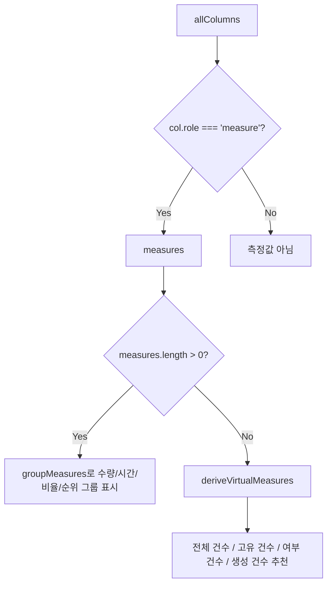
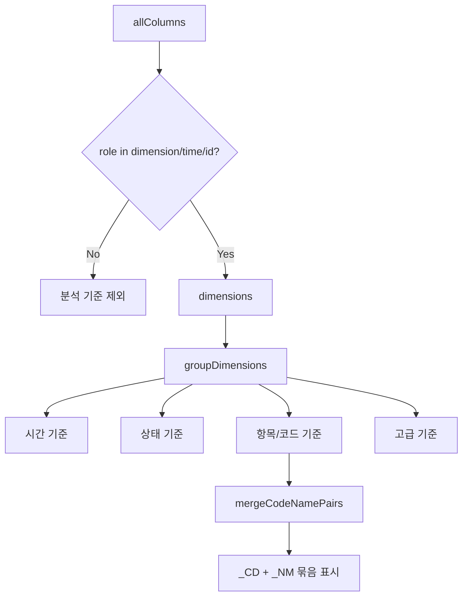
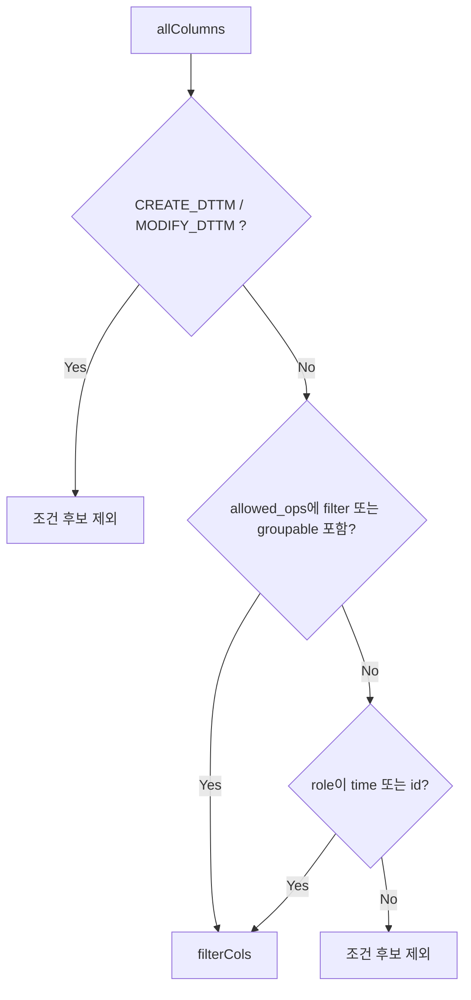
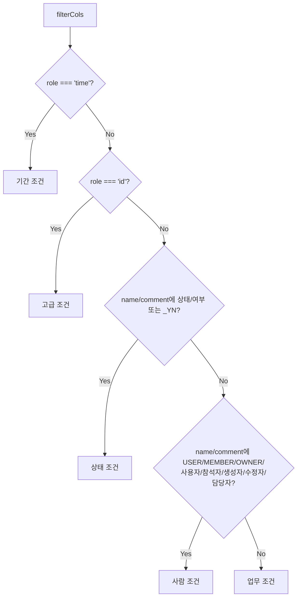
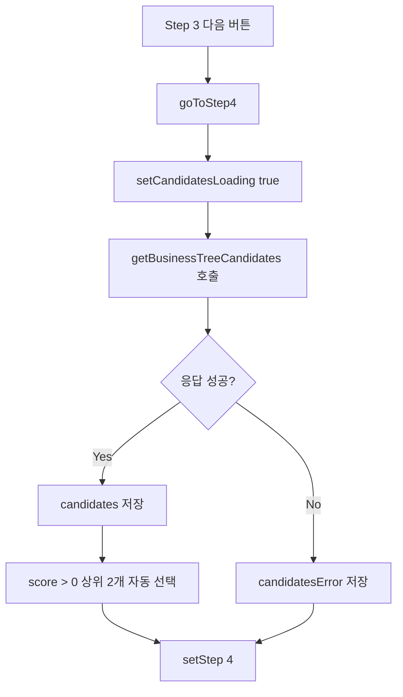
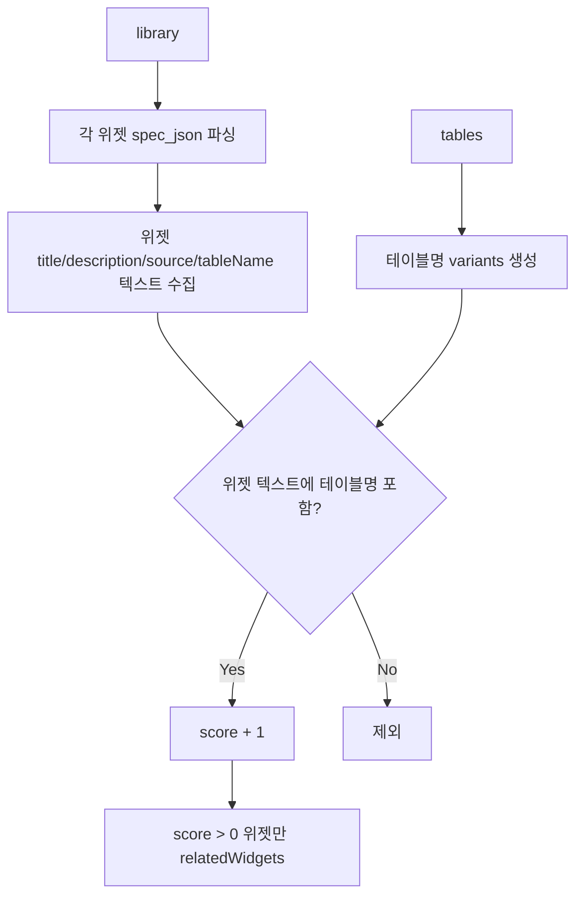

# DomainBrowseTab 1~4단계 화면 데이터 구성 흐름

대상 파일: `DomainBrowseTab.jsx`

## 1. 수치 컬럼은 무엇을 기준으로 구분하는가?

현재 `DomainBrowseTab`에서 Step 2의 **측정값(MEASURE)**, 즉 화면에서 말하는 수치 컬럼은 컬럼의 `type`이 아니라 **컬럼 메타의 `role` 값**을 기준으로 구분한다.

```js
const measures = useMemo(
  () => allColumns.filter((c) => c.role === 'measure'),
  [allColumns],
);
```

즉, 어떤 컬럼이 `DECIMAL`, `NUMBER`, `INTEGER` 같은 DB 타입이어도 `role: 'measure'`로 내려오지 않으면 Step 2의 측정값 영역에는 표시되지 않는다.

반대로 현재 화면에 다음 문구가 보인다면:

```text
이 목적에는 수치 컬럼이 없습니다. 건수 기반 지표를 선택해 위젯을 만들 수 있습니다.
```

그 의미는 다음과 같다.

```text
선택한 목적의 allColumns 중 role === 'measure'인 컬럼이 0개다.
```

## 2. 수치 컬럼 관련 로직 구분

수치 컬럼과 관련된 로직은 세 층으로 나뉜다.

| 구분 | 기준 | 사용 위치 | 의미 |
| --- | --- | --- | --- |
| 측정값 여부 | `col.role === 'measure'` | Step 2 측정값 목록 | 이 컬럼을 값/지표로 선택할 수 있는가 |
| 측정값 그룹 | `comment`, `name` 키워드 | Step 2 측정값 그룹 표시 | 수량/시간/비율/순위 등으로 묶기 |
| 차트 추천 | `col.type`, `col.name` | Step 1 위젯 예시 | 어떤 차트 예시를 만들 수 있는가 |

### 2.1 측정값 여부

Step 2에서 수치 컬럼으로 인정되는 1차 조건이다.

```js
col.role === 'measure'
```

예:

```json
{
  "name": "PLAN_QTY",
  "comment": "계획 수량",
  "type": "DECIMAL",
  "role": "measure"
}
```

이 경우 Step 2의 측정값에 표시된다.

하지만 아래처럼 `type`은 숫자형이어도 `role`이 `measure`가 아니면 측정값에 표시되지 않는다.

```json
{
  "name": "SEQ",
  "comment": "순번",
  "type": "INTEGER",
  "role": "id"
}
```

### 2.2 측정값 그룹

`role === 'measure'`로 분류된 뒤에는 `groupMeasures()`에서 화면 표시 그룹을 나눈다.

| 그룹 | `comment` 키워드 | `name` 키워드 |
| --- | --- | --- |
| 수량 지표 | `수량`, `량`, `건수`, `수`, `개` | `QTY`, `CNT`, `COUNT`, `AMT` |
| 시간 지표 | `시간`, `기간`, `분` | `TIME`, `TM`, `DUR`, `HOUR` |
| 비율 지표 | `율`, `비율`, `%` | `RATE`, `RATIO`, `PCT` |
| 순위/번호 | `순위`, `번호` | `RANK`, `SEQ` |
| 기타 | 위 조건에 걸리지 않음 | 위 조건에 걸리지 않음 |

이 그룹핑은 "측정값인지 아닌지"를 판단하는 로직이 아니라, 이미 측정값으로 판단된 컬럼을 보기 좋게 묶는 표시 로직이다.

### 2.3 수치 컬럼이 없을 때의 가상 측정값

`role === 'measure'` 컬럼이 없으면 `deriveVirtualMeasures(allColumns)`가 건수 기반 지표를 만든다.

| 가상 지표 | 생성 조건 | 표시명 | 계산 의미 |
| --- | --- | --- | --- |
| 전체 건수 | 항상 생성 | 전체 건수 | `COUNT(*)` |
| 고유 건수 | `ID` 또는 `_ID` 컬럼 존재 | 고유 건수 | `COUNT(ID 컬럼)` |
| 여부 건수 | `_YN` 컬럼 존재 | `{컬럼명} 건수` | `COUNT WHERE 컬럼='Y'` |
| 생성 건수 | DATE 타입 또는 `_DTTM`, `_DT` 컬럼 존재 | 생성 건수 | `COUNT(날짜 컬럼)` |

따라서 현재 화면의 "수치 컬럼 없음"은 위젯을 만들 수 없다는 뜻이 아니라, 실제 Measure 컬럼 대신 건수 기반 지표를 추천한다는 뜻이다.

## 3. 전체 데이터 흐름 개요

```mermaid
flowchart TD
  A[WidgetBuilderPopup domain 탭 열림<br/>(현재 비활성)] --> B[getWidgetLibrary]
  A --> C[DomainBrowseTab mount]
  C --> D[useBusinessTreeSource]
  D --> E[getBusinessTreeModules]
  E --> F[selectedModule 자동 선택]
  F --> G[loadModule(selectedModule)]
  G --> H[getBusinessTree(module)]
  H --> I[entriesByModule 저장]
  I --> J[keywords / tables / columns 파생]
  J --> K[Step 1 목적 화면]
  K --> L[Step 2 지표/기준 화면]
  L --> M[Step 3 조건 화면]
  M --> N[getBusinessTreeCandidates]
  N --> O[Step 4 데이터 후보 화면]
```

## 4. 공통 원천 데이터

### 4.1 부모에서 전달되는 데이터

| 데이터 | 출처 | 사용처 |
| --- | --- | --- |
| `library` | `getWidgetLibrary()` | Step 1 재사용 위젯 수, Step 4 라이브러리 탭 |
| `libraryLoading` | 라이브러리 조회 상태 | Step 4 라이브러리 탭 로딩 |
| `onSelect` | 부모 팝업 callback | 라이브러리 위젯 추가, 최종 위젯 추가 |

### 4.2 훅에서 전달되는 데이터

| 데이터 | 생성 로직 | 사용처 |
| --- | --- | --- |
| `availableModules` | `getBusinessTreeModules()` 응답 | Step 1 모듈 목록 |
| `keywords` | 현재 모듈 entries의 `keyword` 중복 제거 | Step 1 목적 목록 |
| `keywordDescriptions` | 목적별 테이블 설명 최대 2개 조합 | Step 1 목적 설명 |
| `tablesForKeyword(keyword)` | 목적에 연결된 테이블 중복 제거 | Step 1 사용 데이터, Step 4 후보 매칭 |
| `columnsForKeyword(keyword)` | 목적에 연결된 컬럼 중복 제거 | Step 2, Step 3 |

## 5. Step 1. 목적 화면 데이터 구성

### 5.1 입력 데이터

| 입력 | 설명 |
| --- | --- |
| `moduleOptions` | `availableModules`가 있으면 사용, 없으면 `FALLBACK_MODULES` |
| `keywords` | 선택된 모듈의 목적 목록 |
| `keywordDescriptions` | 목적별 설명 |
| `tables` | `tablesForKeyword(selectedKeyword)` |
| `allColumns` | `columnsForKeyword(selectedKeyword)` |
| `suggestions` | `deriveWidgetSuggestions(selectedKeyword, tables)` |
| `relatedWidgets` | `library`에서 현재 목적 테이블명과 매칭된 위젯 |

### 5.2 생성 흐름

```mermaid
flowchart TD
  A[selectedModule] --> B[loadModule]
  B --> C[entriesByModule[selectedModule]]
  C --> D[keywords 생성]
  C --> E[keywordDescriptions 생성]
  D --> F[목적 목록 표시]
  F --> G[selectedKeyword 선택]
  G --> H[tablesForKeyword]
  G --> I[columnsForKeyword]
  H --> J[tables]
  I --> K[allColumns]
  J --> L[tablesByRole]
  J --> M[deriveWidgetSuggestions]
  J --> N[relatedWidgets 매칭]
  K --> O[컬럼 후보 수]
```

### 5.3 화면 표시 데이터 도식표

| 화면 영역 | 표시 데이터 | 데이터 생성 로직 |
| --- | --- | --- |
| 모듈 목록 | `moduleOptions` | `availableModules.length > 0 ? availableModules : FALLBACK_MODULES` |
| 목적 목록 | `keywords` | 현재 모듈 entries에서 `keyword` 중복 제거 후 정렬 |
| 목적 설명 | `keywordDescriptions[kw]` | 목적에 연결된 테이블 설명 최대 2개 연결 |
| 목적 헤더 | `selectedKeyword`, `selectedModule` | 사용자가 선택한 값 |
| 연결 테이블 수 | `tables.length` | `tablesForKeyword(selectedKeyword)` |
| 컬럼 후보 수 | `allColumns.length` | `columnsForKeyword(selectedKeyword)` |
| 위젯 예시 수 | `suggestions.length` | 테이블 컬럼 구조 기반 추천 |
| 재사용 위젯 수 | `relatedWidgets.length` | 라이브러리 위젯 spec에서 테이블명 문자열 매칭 |
| 사용 데이터 목록 | `visibleTables` | `tablesByRole`을 펼친 뒤 최대 6개 |
| 위젯 예시 | `suggestions.slice(0, 4)` | 날짜/숫자, 코드/숫자, 숫자, 기본 테이블 규칙 |
| 라이브러리 | `relatedWidgets.slice(0, 3)` | 관련 테이블 매칭 위젯 |

### 5.4 Step 1의 핵심 판단

Step 1은 실제 데이터를 고르는 단계가 아니라, 사용자가 선택한 목적에 대해 다음을 판단하게 하는 단계다.

```text
- 연결된 데이터가 있는가?
- 컬럼 후보가 있는가?
- 만들 수 있는 위젯 예시가 있는가?
- 기존 위젯을 재사용할 수 있는가?
```

## 6. Step 2. 지표/기준 화면 데이터 구성

### 6.1 입력 데이터

| 입력 | 설명 |
| --- | --- |
| `allColumns` | 선택 목적에 연결된 전체 컬럼 |
| `measures` | `role === 'measure'` 컬럼 |
| `dimensions` | `role`이 `dimension`, `time`, `id`인 컬럼 |
| `selectedMetrics` | 사용자가 선택한 측정값 Set |
| `selectedDimensions` | 사용자가 선택한 분석 기준 Set |

### 6.2 수치 컬럼 판단 흐름



### 6.3 분석 기준 판단 흐름



### 6.4 화면 표시 데이터 도식표

| 화면 영역 | 표시 데이터 | 데이터 생성 로직 |
| --- | --- | --- |
| 제목 | `지표와 기준 선택` | 고정 텍스트 |
| 안내 문구 | `이 위젯에서 보여줄 측정값과 분석 기준을 선택하세요.` | 고정 텍스트 |
| 수치 컬럼 없음 Alert | `hasMeasures === false` | `measures.length === 0` |
| 측정값 목록 | `measureGroups` 또는 `virtualMeasures` | 실제 Measure가 있으면 `groupMeasures(measures)`, 없으면 `deriveVirtualMeasures(allColumns)` |
| 분석 기준 목록 | `dimGroups` | `groupDimensions(dimensions)` 후 일부 코드/명칭 묶음 |
| 고급 기준 접기 | `group.isAdvanced` | `role === 'id'` 컬럼 |
| 우측 선택 요약 | 선택한 측정값/기준 | `selectedMetrics`, `selectedDimensions` 기준으로 표시 |
| 원본 컬럼 보기 | 선택된 원본 컬럼명 | `step2RawColsOpen`이 true일 때 표시 |

### 6.5 측정값 그룹 표시 기준

| 표시 그룹 | 대상 |
| --- | --- |
| 수량 지표 | `comment`에 수량/량/건수/수/개, 또는 `name`에 QTY/CNT/COUNT/AMT |
| 시간 지표 | `comment`에 시간/기간/분, 또는 `name`에 TIME/TM/DUR/HOUR |
| 비율 지표 | `comment`에 율/비율/%, 또는 `name`에 RATE/RATIO/PCT |
| 순위/번호 | `comment`에 순위/번호, 또는 `name`에 RANK/SEQ |
| 기타 | 위 그룹에 속하지 않는 Measure |

### 6.6 분석 기준 그룹 표시 기준

| 표시 그룹 | 대상 |
| --- | --- |
| 시간 기준 | `role === 'time'` |
| 상태 기준 | `_YN` 컬럼, 또는 comment에 `여부`/`상태` 포함 |
| 항목/코드 기준 | 일반 dimension |
| 고급 기준 | `role === 'id'` |

## 7. Step 3. 조건 화면 데이터 구성

### 7.1 입력 데이터

| 입력 | 설명 |
| --- | --- |
| `allColumns` | 선택 목적의 전체 컬럼 |
| `filterCols` | 조건 후보 컬럼 |
| `selectedFilters` | 사용자가 선택한 조건 Set |

### 7.2 조건 후보 생성 흐름



### 7.3 조건 그룹화 흐름



### 7.4 화면 표시 데이터 도식표

| 화면 영역 | 표시 데이터 | 데이터 생성 로직 |
| --- | --- | --- |
| 제목 | `조건 선택` | 고정 텍스트 |
| 안내 문구 | `조회 범위를 업무 기준으로 좁히세요.` | 고정 텍스트 |
| 조건 없음 Alert | `filterCols.length === 0` | 조건 후보가 없으면 표시 |
| 전체 데이터 안내 | `filterCols.length > 0` | 조건 미선택 시 전체 데이터 기준 안내 |
| 기간 조건 | `grouped.time` | `role === 'time'` |
| 업무 조건 | `grouped.business` | 다른 그룹에 속하지 않는 조건 |
| 사람 조건 | `grouped.people` | 사용자/참석자/생성자 등 키워드 |
| 상태 조건 | `grouped.status` | `_YN`, 상태, 여부 |
| 고급 조건 | `grouped.advanced` | `role === 'id'` |
| 우측 조건 요약 | `selectedLabels` | `selectedFilters`에 포함된 컬럼의 `comment || name` |
| 기간 조건 경고 | 기간 후보가 있는데 미선택 | `hasTimeCols && !timeColsSelected` |

### 7.5 Step 2 분석 기준과 Step 3 조건의 차이

| 구분 | 분석 기준 | 조건 |
| --- | --- | --- |
| 사용자 질문 | 무엇별로 볼까? | 무엇만 볼까? |
| SQL 관점 | `GROUP BY` | `WHERE` |
| 화면 역할 | X축, 범주, 행/열 기준 | 필터, 조회 범위 |
| 예 | 품목별, 고객별, 월별 | 최근 3개월, 특정 공장만, 완료 상태만 |

## 8. Step 4. 데이터 후보 화면 데이터 구성

### 8.1 입력 데이터

| 입력 | 설명 |
| --- | --- |
| `selectedModule` | Step 1 선택 모듈 |
| `selectedKeyword` | Step 1 선택 목적 |
| `selectedMetrics` | Step 2 선택 측정값 |
| `selectedDimensions` | Step 2 선택 분석 기준 |
| `selectedFilters` | Step 3 선택 조건 |
| `relatedWidgets` | 기존 라이브러리 위젯 매칭 결과 |

### 8.2 후보 조회 흐름

Step 3에서 `다음: 데이터 후보 확인` 버튼을 누르면 `goToStep4()`가 실행된다.



API 요청 payload:

```js
{
  module: selectedModule,
  keyword: selectedKeyword,
  selected_metrics: [...selectedMetrics],
  selected_dimensions: [...selectedDimensions],
  selected_filters: [...selectedFilters],
}
```

### 8.3 화면 표시 데이터 도식표

| 화면 영역 | 표시 데이터 | 데이터 생성 로직 |
| --- | --- | --- |
| 상단 탭 1 | `데이터 테이블 후보 (${candidates.length})` | 후보 API 응답 수 |
| 상단 탭 2 | `라이브러리 위젯 (${relatedWidgets.length})` | 기존 위젯 테이블명 매칭 수 |
| 로딩 | `candidatesLoading` | 후보 API 호출 중 |
| 에러 | `candidatesError` | 후보 API 실패 |
| 후보 없음 | `candidates.length === 0` | 응답은 성공했지만 후보 없음 |
| 사용할 테이블 count | `selectedTables.size` | 후보 카드 선택 Set |
| 후보 카드 | `candidates` | 서버 후보 응답 |
| 라이브러리 카드 | `relatedWidgets` | 기존 위젯 매칭 결과 |

### 8.4 후보 카드 표시 데이터

| 카드 요소 | 후보 필드 | 설명 |
| --- | --- | --- |
| 역할 Chip | `candidate.table_role` | FACT, MASTER, CONFIG 등 |
| 점수 Chip | `candidate.score` | 서버가 계산한 매칭 점수 |
| 제목 | `candidate.table_description || candidate.table_name` | 설명 우선, 없으면 테이블명 |
| 단위 | `candidate.grain` | 데이터 grain |
| 경고 | `candidate.warnings[0]` | 분석 대상이 아닐 수 있음 등 |
| 매칭 컬럼 | `candidate.matched_columns.slice(0, 4)` | 후보와 선택 의도 간 매칭 컬럼 |

### 8.5 라이브러리 위젯 매칭 흐름



## 9. 1~4단계 데이터 흐름 요약표

| 단계 | 사용자가 선택 | 주요 원천 | 파생 데이터 | 다음 단계로 전달 |
| --- | --- | --- | --- | --- |
| Step 1 목적 | 모듈, 목적 | `availableModules`, `keywords`, `tablesForKeyword`, `columnsForKeyword`, `library` | `tables`, `allColumns`, `suggestions`, `relatedWidgets` | `selectedModule`, `selectedKeyword` |
| Step 2 지표/기준 | 측정값, 분석 기준 | `allColumns` | `measures`, `virtualMeasures`, `dimensions`, `dimGroups` | `selectedMetrics`, `selectedDimensions` |
| Step 3 조건 | 필터 조건 | `allColumns` | `filterCols`, `grouped`, `selectedLabels` | `selectedFilters` |
| Step 4 데이터 후보 | 후보 테이블 또는 라이브러리 위젯 | `selectedModule`, `selectedKeyword`, `selectedMetrics`, `selectedDimensions`, `selectedFilters`, `library` | `candidates`, `selectedTables`, `relatedWidgets` | Step 5의 `visualDataSources` 또는 즉시 `onSelect` |

## 10. 현재 화면의 "수치 컬럼 없음" 원인 해석

스크린샷의 문구는 다음 조건에서 표시된다.

```js
const hasMeasures = measures.length > 0;
...
{hasMeasures ? renderCaseB() : renderCaseA()}
```

즉 현재 선택 목적의 컬럼 목록에 다음 조건을 만족하는 컬럼이 없다.

```js
col.role === 'measure'
```

가능한 원인은 다음과 같다.

| 가능 원인 | 설명 |
| --- | --- |
| 실제 수치 컬럼이 없음 | 해당 목적이 기준정보/마스터 성격이라 수량/금액 컬럼이 없음 |
| 수치 타입은 있지만 role이 없음 | `type`은 DECIMAL/NUMBER지만 `role`이 `measure`로 세팅되지 않음 |
| 메타 생성 규칙 누락 | 서버 또는 메타 관리에서 수치 컬럼의 semantic role을 부여하지 않음 |
| CONFIG/MASTER 테이블 위주 목적 | 후보가 기준정보 테이블이면 수치형 분석 지표가 없을 수 있음 |

따라서 수치 컬럼 판단을 더 정확히 하려면 서버 메타에서 다음을 보장하는 것이 좋다.

```json
{
  "name": "PLAN_QTY",
  "comment": "계획 수량",
  "type": "DECIMAL",
  "role": "measure",
  "aggregation": "SUM"
}
```

프론트에서 보완하려면 `role`이 없더라도 `type`이 숫자형이고 ID/SEQ/코드가 아닌 컬럼을 보조적으로 Measure 후보로 추론하는 로직을 추가할 수 있다. 다만 현재 구현은 `role`을 정답 메타로 보고 동작한다.
