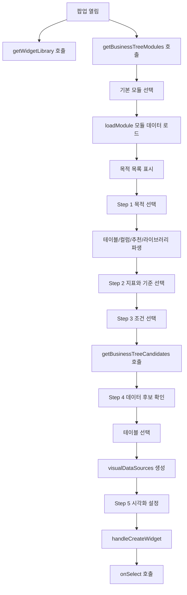

# DomainBrowseTab 단계별 동작 및 표현 의도 분석

대상 파일: `DomainBrowseTab.jsx`

참고 문서: `위젯빌더_목적_구현_가이드.md`

## 1. 문서 목적

이 문서는 `DomainBrowseTab`이 어떤 의도로 구성되어 있고, 5개 단계가 각각 어떤 사용자 경험을 만들고자 하는지 분석한다. 단순히 코드 흐름을 설명하는 것이 아니라, 참고 문서의 핵심 목표인 **DB를 모르는 사용자도 업무 목적 중심으로 단일 위젯을 만들 수 있어야 한다**는 관점에서 현재 구현을 해석한다.

참고 문서가 제시하는 기존 방식과 개선 방향은 다음과 같다.

```text
기존 방식:
테이블 선택 -> 컬럼 선택 -> 데이터 매핑 -> 시각화

개선 방향:
위젯 목적 선택 -> 지표/기준 선택 -> 조건 설정 -> 데이터 후보 확인 -> 시각화
```

`DomainBrowseTab`은 이 개선 방향을 화면으로 구현한 컴포넌트다. 사용자가 테이블명과 컬럼명을 직접 이해하지 못해도, 업무 목적에서 시작해 지표, 분석 기준, 조건, 데이터 후보, 시각화까지 순차적으로 좁혀 가도록 설계되어 있다.

## 2. 전체 설계 방향

### 2.1 사용자의 사고 흐름

이 컴포넌트가 유도하는 사용자의 사고 흐름은 다음과 같다.

```text
어떤 업무 목적의 위젯을 만들까?
-> 어떤 값을 볼까?
-> 무엇별로 나눠 볼까?
-> 어떤 조건으로 조회할까?
-> 시스템이 추천한 데이터 후보는 무엇일까?
-> 어떤 차트로 보여줄까?
```

중요한 점은 사용자가 처음부터 테이블을 선택하지 않는다는 것이다. 참고 문서의 원칙처럼, 이 화면은 테이블 선택기가 아니라 **업무 목적을 위젯으로 변환하는 탐색형 빌더**에 가깝다.

### 2.2 현재 구현의 5단계

| 단계 | 라벨 | 사용자 질문 | 사용자가 선택하는 것 | 내부 결과 |
| --- | --- | --- | --- | --- |
| 1 | 목적 | 어떤 위젯을 만들고 싶은가? | 모듈, 목적 | `selectedModule`, `selectedKeyword` |
| 2 | 지표/기준 | 무엇을 보고, 무엇별로 볼 것인가? | 측정값, 분석 기준 | `selectedMetrics`, `selectedDimensions` |
| 3 | 조건 | 어떤 조건으로 조회할 것인가? | 필터 후보 | `selectedFilters` |
| 4 | 데이터 후보 | 어떤 데이터가 적합한가? | 추천 테이블 또는 기존 위젯 | `selectedTables` 또는 `onSelect(widget)` |
| 5 | 시각화 | 어떻게 보여줄 것인가? | 차트/표시 설정 | `visualConfigs`, 최종 `spec_json` |

## 3. 외부 연결 구조

### 3.1 부모 팝업과의 연결

`DomainBrowseTab`은 원래 `UserWidgetCreatorPopup.jsx`(구 구조, 2026-06-05 삭제)의 `비즈니스 탐색` 탭에서 사용되었다. 현재 호스트 후보는 `WidgetBuilderPopup.jsx`의 `domain` 탭이며, [WidgetBuilderPopup.jsx:330](../widgetbuilder/WidgetBuilderPopup.jsx#L330)에서 탭 등록이 주석 처리되어 비활성 상태이다(컴포넌트 파일은 보존).

부모는 팝업이 열릴 때 `getWidgetLibrary()`로 기존 라이브러리 위젯을 조회한다. 이 목록은 `library`, `libraryLoading`으로 전달된다. `DomainBrowseTab`에서 기존 위젯을 바로 추가하거나 새 위젯을 생성하면 `onSelect(widget)`이 호출되고, 부모는 팝업을 닫는다.

### 3.2 비즈니스 트리 훅

`useBusinessTreeSource`는 업무 메타데이터 기반 탐색의 핵심이다.

| 제공 값 | 의미 |
| --- | --- |
| `availableModules` | 서버에서 조회한 사용 가능 모듈 |
| `loadModule(module)` | 특정 모듈의 비즈니스 트리 로드 |
| `keywords` | 현재 모듈의 위젯 목적 후보 |
| `keywordDescriptions` | 목적별 대표 설명 |
| `tablesForKeyword(keyword)` | 목적에 연결된 테이블 목록 |
| `columnsForKeyword(keyword)` | 목적에 연결된 컬럼 목록 |

이 훅은 AI 없이도 동작 가능한 메타데이터 기반 구조다. 참고 문서의 "AI 없이도 동작해야 한다"는 원칙과 맞닿아 있다.

## 4. 주요 상태와 의미

| 상태 | 의미 |
| --- | --- |
| `step` | 현재 단계. 1부터 5까지 사용 |
| `selectedModule` | 선택된 업무 도메인 |
| `selectedKeyword` | 사용자가 선택한 위젯 목적 |
| `selectedMetrics` | 표시할 값, 즉 Measure |
| `selectedDimensions` | 나누어 볼 기준, 즉 Dimension |
| `selectedFilters` | 조회 조건으로 쓸 필터 |
| `candidates` | 서버가 추천한 데이터 후보 |
| `selectedTables` | 최종 데이터 소스로 선택한 후보 |
| `relatedWidgets` | 같은 목적/데이터와 관련 있는 기존 위젯 |
| `visualDataSources` | 시각화 단계로 넘길 데이터 소스 구조 |
| `visualConfigs` | 시각화 설정 |

## 5. Step 1. 목적

### 5.1 단계 역할

1단계는 사용자가 만들 위젯의 목적을 선택하는 단계다.

참고 문서의 표현으로 바꾸면, 이 단계의 핵심 질문은 다음과 같다.

```text
이 위젯으로 무엇을 보고 싶나요?
```

사용자는 테이블을 고르지 않는다. 대신 모듈과 목적을 고른다.

### 5.2 현재 화면 구성

왼쪽은 모듈 목록과 목적 목록으로 구성된다.

| 영역 | 현재 표시 |
| --- | --- |
| 모듈 | `availableModules` 또는 `FALLBACK_MODULES` |
| 목적 | `keywords`와 목적 설명 한 줄 |

오른쪽은 선택한 목적을 요약한다.

| 영역 | 현재 표시 |
| --- | --- |
| 목적 헤더 | 목적명, 모듈 Chip |
| 목적 설명 | `keywordDescriptions[selectedKeyword]` |
| 요약 숫자 | 연결 테이블, 컬럼 후보, 위젯 예시, 재사용 위젯 수 |
| 사용 데이터 | 목적에 연결된 테이블 일부 |
| 위젯 예시 | `deriveWidgetSuggestions` 결과 일부 |
| 라이브러리 | 관련 기존 위젯 일부 |

### 5.3 표현하고자 하는 바

이 단계가 표현하려는 것은 "선택한 목적이 실제 위젯으로 만들 수 있는 업무 주제인지"다.

사용자는 다음을 한눈에 판단해야 한다.

```text
- 이 목적이 어떤 의미인지
- 이 목적에 연결된 데이터가 있는지
- 어떤 위젯 예시가 가능한지
- 이미 비슷한 위젯이 있는지
- 다음 단계로 넘어가도 되는지
```

### 5.4 참고 문서 대비 현재 구현 평가

참고 문서는 1단계 우측 영역에 다음 정보가 필요하다고 말한다.

```text
- 선택한 목적 설명
- 만들 수 있는 위젯 예시
- 관련 데이터 후보 요약
- 기존 위젯 존재 여부
- 다음 단계 안내
```

현재 구현은 이 중 대부분을 포함한다. 다만 "다음 단계 안내"는 별도의 설명 텍스트보다는 하단 `다음` 버튼으로만 표현된다.

### 5.5 개선 포인트

현재 목적 목록에는 `keyword`가 그대로 표시된다. 만약 `keyword`가 `workflow_stage`, `policy_parameter` 같은 물리적/기술적 이름이면 참고 문서의 원칙과 어긋난다.

개선 방향은 다음과 같다.

```text
현재:
workflow_stage
policy_parameter

권장:
워크플로우 단계 현황
정책 파라미터별 계획 설정
```

즉, `keyword`와 별도로 `business_name`, `purpose_name`, `display_name` 같은 업무 표시명이 필요하다.

## 6. Step 2. 지표/기준

### 6.1 단계 역할

2단계는 위젯의 분석 구조를 결정한다.

참고 문서의 핵심 문장은 다음과 같다.

```text
무엇을 볼 것인가?       -> Measure
무엇별로 나눠 볼 것인가? -> Dimension
```

현재 구현도 이 구조를 그대로 따른다. `measures`와 `dimensions`를 분리해 두 영역으로 보여준다.

### 6.2 현재 데이터 분류

| 영역 | 코드상 기준 | 의미 |
| --- | --- | --- |
| 측정값 | `role === 'measure'` | 수량, 금액, 시간, 비율 등 값 |
| 분석 기준 | `role`이 `dimension`, `time`, `id` | 품목, 고객, 기간, 조직, ID 등 기준 |

각 항목은 `ColCheckItem`으로 표시되며 클릭하면 선택 상태가 토글된다.

### 6.3 표현하고자 하는 바

이 단계는 사용자가 "차트를 어떻게 만들지"를 직접 고민하기 전에 분석 질문의 구조를 만들도록 한다.

예를 들어 사용자가 다음처럼 선택한다고 볼 수 있다.

```text
측정값: 생산 수량
분석 기준: 품목 그룹, 공장
```

이 선택은 이후 데이터 후보 조회에서 "생산 수량을 계산할 수 있고, 품목 그룹과 공장 기준으로 그룹핑 가능한 데이터가 필요하다"는 의미가 된다.

### 6.4 참고 문서 대비 현재 구현 평가

참고 문서는 다음 규칙을 제안한다.

```text
- Measure는 최소 1개 이상 필요
- Dimension은 1~3개 권장
- Dimension만 선택된 상태는 지양
- ID성 컬럼은 기본 화면에서 제외 또는 고급 기준으로 이동
- 코드/명칭 컬럼은 하나의 업무 기준으로 묶음
```

현재 구현은 Measure/Dimension을 분리하지만, 위 규칙을 강제하지는 않는다.

현재 동작은 다음과 같다.

| 항목 | 현재 구현 |
| --- | --- |
| Measure 최소 1개 | 강제하지 않음 |
| Dimension 개수 권장 | 강제하지 않음 |
| Dimension만 선택 방지 | 없음 |
| ID성 컬럼 숨김 | `id`도 Dimension에 포함 |
| 코드/명칭 묶음 | 없음 |

### 6.5 개선 포인트

2단계는 참고 문서 기준으로 아직 "DB를 모르는 사용자용"으로 더 다듬을 여지가 있다.

권장 개선은 다음과 같다.

1. Measure가 없는 경우 `COUNT(*)`, `COUNT(ID)`, `COUNT(CREATE_DTTM)` 같은 파생 지표를 추천한다.
2. ID성 컬럼은 기본 목록에서 숨기고 고급 기준으로 이동한다.
3. `ITEM_CD`, `ITEM_NM`처럼 코드와 명칭은 하나의 업무 기준인 "품목"으로 묶는다.
4. Dimension은 역할별 그룹으로 나눈다.

예:

```text
품목 기준
- 품목
- 품목 그룹

시간 기준
- 생성일자
- 작업 시작일

상태 기준
- 완료 여부
- 확정 여부
```

## 7. Step 3. 조건

### 7.1 단계 역할

3단계는 조회 범위와 필터 조건을 선택하는 단계다.

참고 문서의 질문은 다음과 같다.

```text
어떤 조건으로 데이터를 조회할 것인가?
```

### 7.2 현재 조건 후보 선정

현재 `filterCols`는 다음 기준으로 만들어진다.

1. `CREATE_DTTM`, `MODIFY_DTTM`은 제외한다.
2. `allowed_ops`에 `filter` 또는 `groupable`이 포함되어 있으면 포함한다.
3. `role`이 `time` 또는 `id`이면 포함한다.

### 7.3 표현하고자 하는 바

이 단계는 사용자가 위젯을 실제로 사용할 때 필요한 조회 조건을 미리 고르는 단계다.

예:

```text
기간 조건: 생성일자, 작업일자
업무 조건: 품목, 고객, 공장
상태 조건: 완료 여부, 확정 여부
```

사용자가 선택한 조건은 4단계 후보 조회 API에 `selected_filters`로 전달된다.

### 7.4 참고 문서 대비 현재 구현 평가

참고 문서는 조건이 컬럼 선택이 아니라 업무 필터 선택이어야 한다고 말한다.

현재 구현은 컬럼 메타의 `comment || name`을 보여준다. `comment`가 업무명으로 잘 채워져 있으면 사용자가 이해할 수 있지만, 그렇지 않으면 물리 컬럼명이 드러난다.

또한 참고 문서가 제안한 기본 추천 조건은 아직 구현되어 있지 않다.

```text
권장 기본 조건:
- 최근 3개월
- 삭제된 데이터 제외
```

### 7.5 개선 포인트

1. 조건 후보를 `기간 조건`, `업무 조건`, `사람 조건`, `상태 조건`으로 그룹화한다.
2. 조건을 선택하지 않은 경우 다음 안내를 보여준다.

```text
조건을 선택하지 않으면 전체 데이터를 기준으로 조회합니다.
데이터가 많을 수 있으므로 기간 조건을 설정하는 것을 권장합니다.
```

3. 삭제 여부, 사용 여부, 완료 여부 같은 상태 조건은 기본 추천 또는 자동 적용 후보로 분리한다.

## 8. Step 4. 데이터 후보

### 8.1 단계 역할

4단계는 시스템이 추천한 데이터 후보를 확인하는 단계다.

참고 문서에서 중요한 표현은 다음이다.

```text
사용자는 테이블을 직접 고르는 것이 아니라, 시스템이 추천한 데이터 후보를 확인한다.
```

현재 구현은 서버에서 후보를 가져와 `CandidateCard`로 보여준다. 다만 실제 UI에서는 여전히 테이블명을 표시하기 때문에, 엄밀히 말하면 "테이블 후보 확인"에 가깝다.

### 8.2 진입 시 API 호출

3단계에서 `데이터 후보 조회` 버튼을 누르면 `goToStep4()`가 실행된다.

요청 payload는 다음과 같다.

```js
{
  module: selectedModule,
  keyword: selectedKeyword,
  selected_metrics: [...selectedMetrics],
  selected_dimensions: [...selectedDimensions],
  selected_filters: [...selectedFilters],
}
```

이 payload는 1~3단계에서 수집한 업무 의도를 서버 후보 평가에 전달한다.

### 8.3 현재 후보 카드 표시

`CandidateCard`는 다음 정보를 보여준다.

| 표시 요소 | 의미 |
| --- | --- |
| 역할 Chip | FACT, MASTER, VIEW 등 테이블 역할 |
| 점수 Chip | 후보 매칭 점수 |
| 테이블 설명 또는 테이블명 | 후보 대표명 |
| grain | 데이터 단위 |
| warnings | 사용 시 주의점 |
| matched_columns | 매칭된 컬럼 일부 |

후보 중 점수가 0보다 큰 상위 2개는 자동 선택된다.

### 8.4 내부 탭

4단계에는 두 가지 경로가 있다.

| 탭 | 목적 |
| --- | --- |
| 데이터 테이블 후보 | 새 위젯 생성에 사용할 데이터 후보 선택 |
| 라이브러리 위젯 | 이미 만들어진 위젯을 재사용 |

라이브러리 위젯을 추가하면 5단계로 가지 않고 바로 `onSelect(widget)`이 호출된다.

### 8.5 참고 문서 대비 현재 구현 평가

참고 문서는 후보 평가 기준으로 다음을 제안한다.

```text
1. 지표 계산에 필요한 값이 있는가
2. 테이블 역할이 Fact/Result인지 Master/Config/Log인지
3. 선택한 분석 기준으로 그룹핑 가능한가
4. 선택한 조건으로 필터링 가능한가
5. 데이터 Grain이 위젯 목적과 맞는가
6. 필요한 조인 키가 있는가
7. 운영성/최신성 있는 테이블인가
8. 화면 목적과 직접 관련 있는 테이블인가
```

현재 프론트는 서버가 내려준 `score`, `table_role`, `grain`, `matched_columns`, `warnings`를 표현한다. 즉, 후보 평가 자체는 서버 로직에 위임되어 있고 프론트는 그 결과를 보여주는 구조다.

프론트 관점에서는 다음 표현이 아직 부족하다.

| 참고 문서 권장 | 현재 표현 |
| --- | --- |
| 필수 데이터/보조 데이터 구분 | `table_role` Chip으로 간접 표현 |
| 제외 데이터 안내 | `warnings` 일부 표시 |
| 조인 키 설명 | 없음 |
| 운영성/최신성 | 없음 |
| 업무명 중심 표시 | `table_description`이 있으면 가능, 없으면 테이블명 노출 |

### 8.6 개선 포인트

1. `table_description`보다 명확한 `business_name`을 후보 카드의 주 제목으로 사용한다.
2. 물리 테이블명은 보조 정보 또는 툴팁으로 이동한다.
3. 후보를 `필수 데이터`, `보조 데이터`, `확인 필요`, `제외 권장` 같은 업무적 그룹으로 나눈다.
4. 점수만 보여주기보다 "왜 추천됐는지"를 한 줄로 표현한다.

예:

```text
생산계획 결과 데이터
생산 수량 지표와 품목/공장 기준을 모두 포함합니다.
```

## 9. Step 5. 시각화

### 9.1 단계 역할

5단계는 선택된 목적, 지표, 기준, 조건, 데이터 후보를 바탕으로 차트 형태와 표시 옵션을 정하는 단계다.

참고 문서의 질문은 다음과 같다.

```text
어떻게 보여줄 것인가?
```

### 9.2 현재 데이터 준비

4단계에서 선택한 `selectedTables`는 `visualDataSources`로 변환된다.

```js
{
  id: `domain_source_${tableName}`,
  sourceType: 'TABLE',
  sourceName: tableName,
  tableName,
  module: selectedModule,
  columns,
  mockData: [],
}
```

컬럼은 다음 우선순위로 선택된다.

1. 테이블 자체의 `columns`
2. 후보 응답의 `matched_columns`, `required_columns`, `optional_columns`
3. 목적 전체 컬럼인 `allColumns`

### 9.3 현재 시각화 설정

`visualDraft`는 `Step4_VisualAndPreview`로 전달된다.

| 필드 | 의미 |
| --- | --- |
| `dataSourceMode` | `MULTIPLE` |
| `dataSources` | 선택한 테이블 기반 데이터 소스 |
| `parameterMappings` | 현재 빈 배열 |
| `columnMappings` | 현재 빈 객체 |
| `mergeConfig` | 기본 merge 비활성 |
| `visualConfigs` | 시각화 설정 |

`visualTestResults`는 실제 데이터 행을 담지 않고, 컬럼 구조 중심의 빈 결과를 제공한다.

### 9.4 위젯 생성 결과

`위젯 추가` 버튼을 누르면 `handleCreateWidget()`이 실행된다.

생성되는 위젯 객체는 다음 구조다.

```js
{
  title: finalTitle,
  widget_type: primaryVisualConfig.type || 'table',
  module: selectedModule,
  spec_json: {
    widgetType,
    visualConfig,
    visualConfigs,
    dataSources,
    dataConfig: {
      metrics,
      dimensions,
      filters,
    },
  },
}
```

### 9.5 참고 문서 대비 현재 구현 평가

참고 문서는 다음 추천 기준을 제시한다.

```text
시간 기준 + 수치 지표 -> 라인 차트
범주 기준 + 수치 지표 -> 막대 차트
비율/구성비 -> 도넛/파이 차트
상세 목록 -> 테이블
두 개 이상의 비교 지표 -> 콤보 차트 또는 그룹 막대 차트
```

현재 구현은 1단계에서 `deriveWidgetSuggestions`로 위젯 예시를 만들지만, 5단계의 기본 시각화 설정은 대부분 `chartType` 기본값인 `bar`에 의존한다. 즉, 추천 예시와 실제 5단계 기본 차트 설정이 강하게 연결되어 있지는 않다.

### 9.6 개선 포인트

1. 2단계 선택값을 기준으로 기본 차트 타입을 자동 결정한다.
2. 1단계의 추천 위젯 예시를 클릭하면 그 추천 설정이 5단계까지 전달되게 한다.
3. `visualTestResults`에 실제 샘플 데이터를 채워 미리보기 신뢰도를 높인다.
4. 여러 데이터 소스를 선택한 경우 merge 또는 관계 설정 안내가 필요하다.

## 10. 전체 데이터 흐름



## 11. 현재 구현이 참고 문서와 맞는 부분

| 참고 문서 원칙 | 현재 구현 |
| --- | --- |
| 목적 중심 흐름 | 1단계 `selectedKeyword`에서 시작 |
| 지표/기준 분리 | 2단계 `measures`, `dimensions` 분리 |
| 조건 단계 존재 | 3단계 `filterCols` 선택 |
| 데이터 후보 확인 | 4단계 `getBusinessTreeCandidates` 호출 |
| 시각화 마지막 배치 | 5단계 `Step4_VisualAndPreview` 사용 |
| AI 없이 동작 | 업무 트리 메타데이터와 후보 API 기반 |
| 기존 위젯 재사용 | 4단계 라이브러리 탭 제공 |

## 12. 현재 구현이 참고 문서와 다른 부분

| 참고 문서 권장 | 현재 구현 차이 |
| --- | --- |
| 사용자는 테이블을 고르지 않는다 | 4단계에서 여전히 테이블 후보 카드를 직접 선택 |
| 컬럼명보다 업무명을 보여준다 | `comment`가 없으면 물리 컬럼명 노출 |
| 목적은 업무 문장이어야 한다 | `keyword`가 기술명일 경우 그대로 노출 |
| Measure 최소 1개 권장 | 강제하지 않음 |
| ID성 컬럼 기본 제외 | `id` role도 Dimension에 포함 |
| 코드/명칭 컬럼 묶음 | 묶음 표현 없음 |
| 기본 조건 추천 | 최근 3개월, 삭제 제외 등의 기본 조건 없음 |
| 차트 추천을 먼저 보여줌 | 추천 예시는 있으나 5단계 기본 설정과 약하게 연결 |
| 메타 기반 SQL 생성 | 프론트는 spec 구성까지만 수행 |

## 13. 예외 및 빈 상태 처리

| 상황 | 현재 처리 |
| --- | --- |
| 모듈 목록 없음 | `FALLBACK_MODULES` 사용 |
| 모듈 로딩 중 | 우측 중앙 로딩 표시 |
| 모듈 로드 실패 | 에러 Alert 표시 |
| 목적 없음 | 목적 목록에 `목적 없음` 표시 |
| 목적 미선택 | 우측에 `목적을 선택하세요.` 표시 |
| 컬럼 메타 없음 | 2단계 정보 Alert, 계속 진행 가능 |
| 필터 컬럼 없음 | 3단계 정보 Alert, 계속 진행 가능 |
| 후보 조회 실패 | 4단계 에러 Alert |
| 후보 없음 | 4단계 빈 상태 문구 |
| 라이브러리 위젯 없음 | 4단계 빈 상태 문구 |
| 데이터 소스 미선택 | 5단계 Alert, 위젯 추가 비활성 |

## 14. 메타데이터 관점의 필요 항목

참고 문서 기준으로 `DomainBrowseTab`이 더 좋은 사용자 경험을 만들려면, 현재보다 풍부한 메타데이터가 필요하다.

### 14.1 목적 메타

```json
{
  "purpose_id": "production_qty_by_item_group",
  "display_name": "품목 그룹별 생산 수량",
  "description": "품목 그룹 기준으로 생산 수량을 집계해 비교합니다.",
  "module": "FP",
  "recommended_metrics": ["production_qty"],
  "recommended_dimensions": ["item_group"],
  "recommended_filters": ["date_range", "plant"]
}
```

### 14.2 테이블 메타

```json
{
  "table_id": "TB_FP_RESULT",
  "business_name": "생산계획 결과 데이터",
  "role": "FACT_RESULT",
  "description": "품목, 공장, 작업 기준의 생산계획 결과 데이터",
  "grain": ["item", "plant", "activity"],
  "metrics": ["production_qty", "plan_qty"],
  "dimensions": ["item", "plant", "customer"],
  "filters": ["date_range", "item", "plant"],
  "join_keys": ["item_cd", "plant_cd"],
  "freshness_type": "current",
  "priority": 1
}
```

### 14.3 컬럼 메타

```json
{
  "column_name": "PLAN_QTY",
  "business_name": "계획 수량",
  "semantic_type": "measure",
  "data_type": "number",
  "unit": "EA",
  "description": "계획된 생산 수량",
  "aggregation": "SUM"
}
```

## 15. 향후 개선 우선순위

### 15.1 1순위: 목적과 컬럼의 업무 표시명 강화

현재 UI 개선의 가장 큰 병목은 화면 레이아웃보다 메타 표시명이다. `keyword`, `column.name`, `table_name`이 기술명으로 노출되면 DB를 모르는 사용자는 여전히 어렵다.

우선순위는 다음과 같다.

```text
purpose display_name
column business_name
table business_name
filter group name
```

### 15.2 2순위: Step 2의 추천/검증 로직

Measure가 없거나 사용자가 Dimension만 선택한 경우, 시스템이 파생 지표를 추천해야 한다.

예:

```text
전체 건수
생성 건수
완료 건수
삭제 제외 건수
```

또한 Dimension은 1~3개 권장, ID성 컬럼은 고급 보기 이동이 필요하다.

### 15.3 3순위: Step 3의 조건 그룹화와 기본 조건

조건은 컬럼 목록이 아니라 업무 필터 그룹으로 보여야 한다.

```text
기간 조건
업무 조건
사람 조건
상태 조건
```

기본 추천 조건으로 최근 3개월, 삭제 제외 등을 고려할 수 있다.

### 15.4 4순위: Step 4 후보의 설명력 강화

후보 카드에는 "무엇이 추천됐는가"보다 "왜 추천됐는가"가 필요하다.

예:

```text
생산계획 결과 데이터
선택한 생산 수량 지표와 품목/공장 기준을 모두 포함합니다.
```

### 15.5 5순위: Step 5 추천 차트 연결

1단계의 위젯 예시, 2단계의 Measure/Dimension, 3단계의 조건 선택이 5단계 기본 차트 설정으로 자연스럽게 이어져야 한다.

## 16. 최종 해석

`DomainBrowseTab`은 참고 문서의 목표인 **DB를 모르는 사용자용 Widget Builder** 방향으로 이미 큰 흐름을 갖추고 있다.

현재 구현의 강점은 다음이다.

```text
- 5단계 목적 중심 흐름이 구현되어 있다.
- 업무 목적에서 시작해 지표/기준/조건으로 좁혀 간다.
- 데이터 후보 조회 API와 연결되어 있다.
- 기존 라이브러리 위젯 재사용 경로가 있다.
- 시각화 설정을 마지막 단계로 미뤄 초반 부담을 줄인다.
```

하지만 최종 지향점에 도달하려면 다음이 보강되어야 한다.

```text
- 기술명 대신 업무명 표시
- Measure/Dimension 추천과 검증
- 조건의 업무 그룹화
- 데이터 후보의 추천 사유 설명
- 추천 위젯 예시와 실제 시각화 설정 연결
```

한 줄로 정리하면 다음과 같다.

> `DomainBrowseTab`은 테이블 선택 UI가 아니라, 업무 목적을 지표, 기준, 조건, 데이터 후보, 시각화로 번역하는 메타데이터 기반 위젯 생성 흐름이다.
