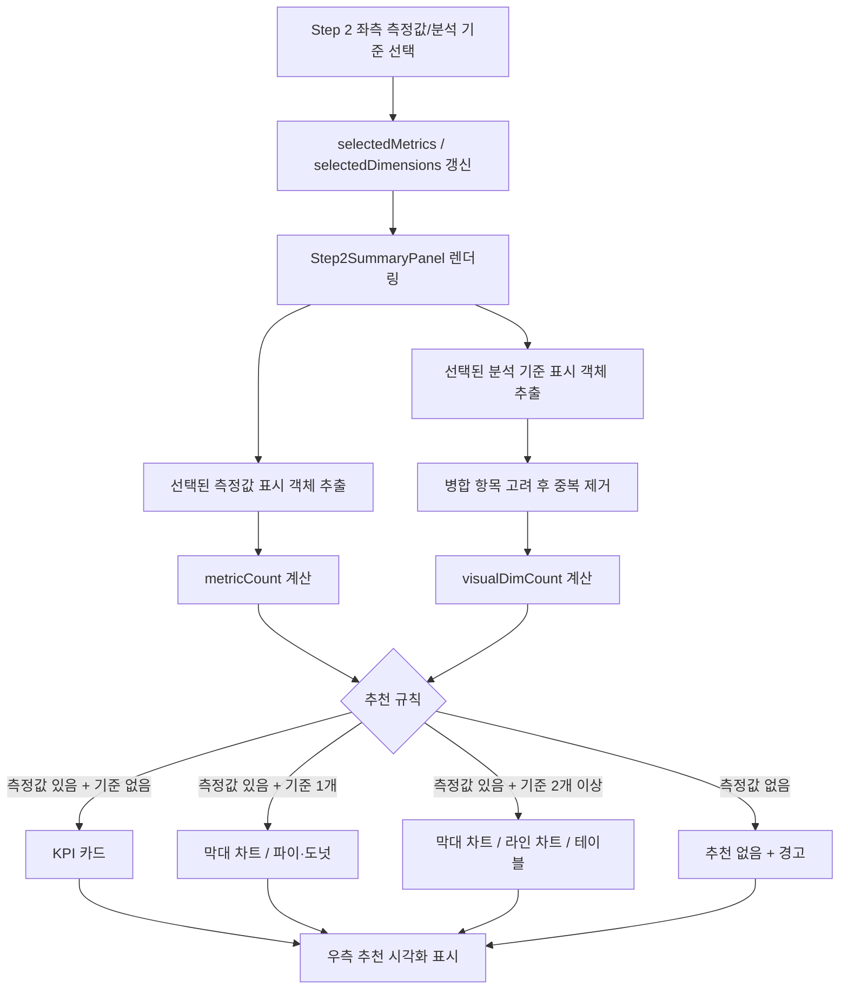

# 비즈니스 탐색 우측 추천 시각화 설정 흐름

대상 파일: `DomainBrowseTab.jsx`

## 1. 문서 목적

이 문서는 비즈니스 탐색 2단계 `지표/기준` 화면의 우측 패널에 표시되는 `추천 시각화`가 어떤 값과 규칙을 기준으로 세팅되는지 정리한다.

중요한 전제는 다음과 같다.

```text
우측 추천 시각화 = 현재 선택값을 보고 보여주는 안내 UI
실제 Step 5 시각화 설정 = selectedTables 기반 dataSource + visualConfigs
```

즉, 우측의 `막대 차트`, `파이/도넛` 추천은 현재 구현상 사용자가 클릭해서 선택하는 값이 아니며, `chartType`이나 `visualConfigs`를 직접 변경하지 않는다.

## 2. 렌더링 위치

2단계 화면은 좌측 선택 영역과 우측 요약 패널로 나뉜다.

```jsx
<Step2SummaryPanel
  selectedMetrics={selectedMetrics}
  selectedDimensions={selectedDimensions}
  allMeasureDisplayItems={allMeasureDisplayItems}
  allDimDisplayItems={allDimDisplayItems}
  rawColsOpen={step2RawColsOpen}
  onRawColsToggle={() => setStep2RawColsOpen((o) => !o)}
/>
```

우측 패널은 `Step2SummaryPanel`이 담당한다.

## 3. 입력 데이터

| 입력값 | 타입 | 의미 | 생성/관리 위치 |
| --- | --- | --- | --- |
| `selectedMetrics` | `Set` | 사용자가 선택한 측정값 컬럼명 목록 | Step 2 측정값 체크박스 |
| `selectedDimensions` | `Set` | 사용자가 선택한 분석 기준 컬럼명 목록 | Step 2 분석 기준 체크박스 |
| `allMeasureDisplayItems` | `Array` | 화면에 표시 가능한 측정값 항목 전체 | 실제 measure + 가상 measure |
| `allDimDisplayItems` | `Array` | 화면에 표시 가능한 분석 기준 항목 전체 | dimension/time/id 및 병합 표시 항목 |
| `rawColsOpen` | `boolean` | 원본 컬럼 보기 펼침 여부 | 우측 패널 내부 토글 |

## 4. 선택 항목 매핑

우측 패널은 `selectedMetrics`, `selectedDimensions`에 들어 있는 원본 컬럼명을 다시 표시용 객체로 변환한다.

### 측정값

```js
const selectedMetricItems = allMeasureDisplayItems.filter((c) =>
  selectedMetrics.has(c.name)
);
```

측정값은 `selectedMetrics`에 들어 있는 `name`과 일치하는 항목만 표시한다.

### 분석 기준

```js
const selectedDimDisplayItems = allDimDisplayItems.filter(
  (item) =>
    selectedDimensions.has(item.name) ||
    (item.isMerged && selectedDimensions.has(item.pairedName))
);
```

분석 기준은 두 가지 경우에 선택된 것으로 본다.

| 조건 | 의미 |
| --- | --- |
| `selectedDimensions.has(item.name)` | 표시 항목 자체가 선택됨 |
| `item.isMerged && selectedDimensions.has(item.pairedName)` | 코드/명칭 병합 항목에서 짝 컬럼이 선택됨 |

이후 `item.name` 기준으로 중복을 제거한다.

```js
const seenKeys = new Set();
const uniqueSelectedDims = selectedDimDisplayItems.filter((item) => {
  if (seenKeys.has(item.name)) return false;
  seenKeys.add(item.name);
  return true;
});
```

## 5. 추천 시각화 결정 규칙

추천 시각화는 데이터 타입, 컬럼명, 테이블 role을 직접 보지 않는다.

현재 구현 기준은 다음 두 개뿐이다.

```text
1. 선택된 측정값 개수
2. 선택된 분석 기준 개수
```

코드상 변수는 다음과 같다.

```js
const metricCount = selectedMetrics.size;
const visualDimCount = uniqueSelectedDims.length;
```

추천 규칙은 아래 표와 같다.

| 측정값 개수 | 분석 기준 개수 | 추천 시각화 | 해석 |
| ---: | ---: | --- | --- |
| 0 | 상관없음 | 없음 | 측정할 값이 없으므로 차트 추천 불가 |
| 1개 이상 | 0 | KPI 카드 | 전체 합계/건수처럼 단일 수치만 보여주는 형태 |
| 1개 이상 | 1 | 막대 차트, 파이/도넛 | 하나의 기준별 수치 비교 또는 비중 표현 |
| 1개 이상 | 2개 이상 | 막대 차트, 라인 차트, 테이블 | 여러 기준 조합을 비교하거나 추세/목록으로 확인 |

실제 코드 흐름은 다음과 같다.

```js
let recommendedCharts = [];

if (metricCount > 0 && visualDimCount === 0) {
  recommendedCharts = [
    { type: 'kpi', label: 'KPI 카드' },
  ];
} else if (metricCount > 0 && visualDimCount === 1) {
  recommendedCharts = [
    { type: 'bar', label: '막대 차트' },
    { type: 'pie', label: '파이/도넛' },
  ];
} else if (metricCount > 0 && visualDimCount >= 2) {
  recommendedCharts = [
    { type: 'bar', label: '막대 차트' },
    { type: 'line', label: '라인 차트' },
    { type: 'table', label: '테이블' },
  ];
}
```

## 6. 화면 표시 방식

추천 시각화는 `recommendedCharts` 배열을 그대로 순서대로 렌더링한다.

```js
{recommendedCharts.map(({ type, label }, i) => {
  const Icon = WIDGET_TYPE_ICONS[type] || BarChartIcon;
  return (
    ...
  );
})}
```

표시 방식은 다음과 같다.

| 표시 요소 | 결정 방식 |
| --- | --- |
| 차트 아이콘 | `WIDGET_TYPE_ICONS[type]` |
| 차트 라벨 | `recommendedCharts[].label` |
| 첫 번째 추천 강조 | `i === 0`이면 강조 색상 |
| 두 번째 이후 추천 | 보조 후보로 회색 표시 |

아이콘 매핑은 다음과 같다.

| type | 아이콘 |
| --- | --- |
| `bar`, `bar_stacked`, `bar_h` | `BarChartIcon` |
| `line`, `area`, `bar_line` | `ShowChartIcon` |
| `pie`, `doughnut` | `PieChartIcon` |
| `table` | `TableChartIcon` |
| `kpi` | `SpeedIcon` |

## 7. 예시 위젯 문구

우측 패널의 `예시 위젯` 문구는 첫 번째 측정값과 첫 번째 분석 기준이 모두 있을 때만 표시된다.

```js
const firstMetric = selectedMetricItems[0];
const firstDim = uniqueSelectedDims[0];
```

```jsx
{firstMetric && firstDim && (
  `"${firstDim.displayName || firstDim.comment || firstDim.name}별 ${firstMetric.displayName || firstMetric.comment || firstMetric.name}"`
)}
```

예를 들어 다음처럼 선택한 경우:

| 선택 | 값 |
| --- | --- |
| 측정값 | `DTF` |
| 분석 기준 | `최하단 레벨 여부` |

화면에는 다음과 같은 문구가 표시된다.

```text
"최하단 레벨 여부별 DTF"
```

## 8. 경고 메시지

우측 패널은 추천 시각화와 별개로 경고도 생성한다.

| 조건 | 경고 |
| --- | --- |
| `metricCount === 0` | 위젯 생성에는 최소 1개의 측정값이 필요합니다. |
| `visualDimCount >= 4` | 분석 기준이 많으면 차트가 복잡해질 수 있습니다. 1~3개를 권장합니다. |

경고는 `Alert severity="warning"`으로 표시된다.

## 9. 실제 Step 5 시각화 설정과의 관계

우측 추천 시각화는 현재 구현상 실제 시각화 설정을 자동으로 바꾸지 않는다.

실제 Step 5의 시각화 설정은 4단계에서 선택한 데이터 후보 테이블을 기준으로 `visualDataSources`를 만들고, 그 결과를 기반으로 `visualConfigs`를 초기화한다.

```js
useEffect(() => {
  if (visualDataSources.length === 0) return;
  setVisualConfigs((prev) => {
    const next = {};
    visualDataSources.forEach((ds, index) => {
      next[ds.id] = prev[ds.id] || {
        ...defaultVisualConfig(index === 0 ? chartType : 'table'),
        widgetTitle: widgetTitle || selectedKeyword || ds.sourceName,
      };
    });
    return hasSameSources ? prev : next;
  });
}, [chartType, selectedKeyword, visualDataSources, widgetTitle]);
```

현재 `chartType`의 초기값은 다음과 같다.

```js
const [chartType, setChartType] = useState('bar');
```

따라서 별도 변경이 없다면:

| 데이터 소스 순서 | 기본 시각화 |
| --- | --- |
| 첫 번째 데이터 소스 | `defaultVisualConfig(chartType)` → 기본 `bar` |
| 두 번째 이후 데이터 소스 | `defaultVisualConfig('table')` |

## 10. 전체 흐름도



## 11. 현재 구현의 한계

| 한계 | 설명 |
| --- | --- |
| 추천이 실제 선택으로 이어지지 않음 | 우측 추천 차트를 클릭해도 `chartType`이 바뀌는 구조가 아님 |
| 컬럼 타입을 고려하지 않음 | 시간 기준이 있어도 자동으로 라인 차트를 1순위로 올리지 않음 |
| 측정값 의미를 고려하지 않음 | 비율, 금액, 수량, 건수에 따라 추천 차트를 다르게 고르지 않음 |
| 데이터 후보와 연결되지 않음 | Step 4에서 실제 사용 가능한 테이블/컬럼 여부와 추천 차트가 직접 연결되지 않음 |

## 12. 개선 방향

추천 시각화를 실제 UX로 연결하려면 다음 흐름이 자연스럽다.

```text
Step 2 추천 시각화 클릭
-> chartType 변경
-> 선택 상태 강조
-> Step 5 visualConfigs 초기값에 반영
```

예상 구현 방향:

| 개선 항목 | 변경 내용 |
| --- | --- |
| 추천 차트 클릭 가능화 | `recommendedCharts` 항목에 `onClick` 추가 |
| 선택 차트 상태 추가 | `chartType` 또는 별도 `selectedRecommendedChart` 상태 갱신 |
| Step 5 연계 | 첫 번째 데이터 소스의 `defaultVisualConfig(chartType)`에 반영 |
| 시간 기준 우선 추천 | `role === 'time'` 기준이 선택되면 `line`을 1순위로 추천 |
| 기준 개수별 제한 | 기준 4개 이상이면 테이블을 1순위로 추천 |

